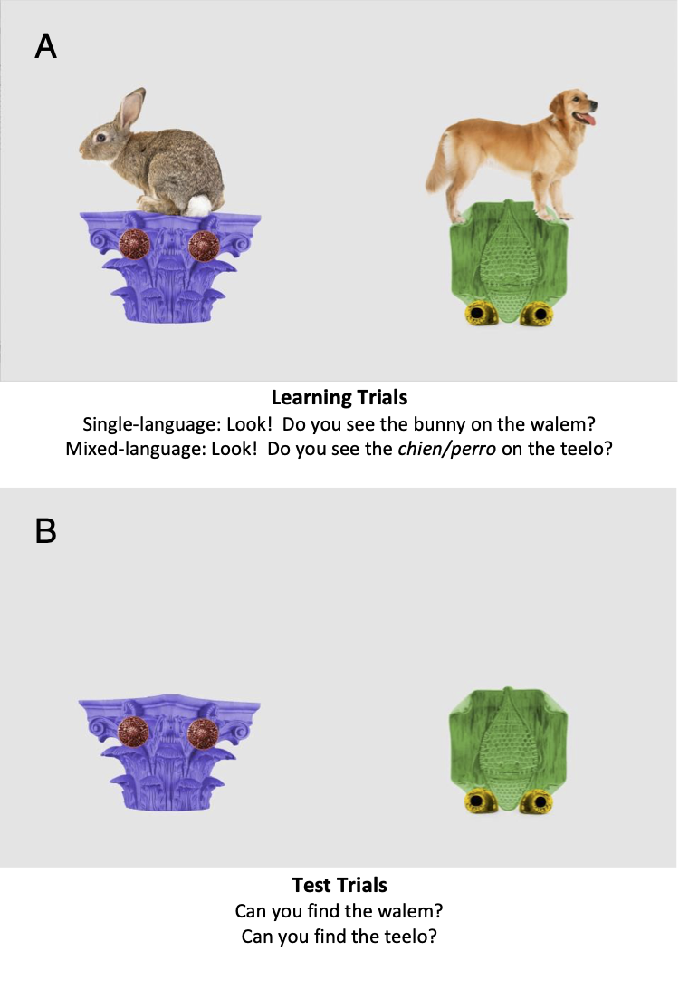

```{r setup, echo = FALSE}
## Test phase: Familiar word at 3000ms
## Training phase: Familiar word at 4500ms


knitr::opts_chunk$set(echo = FALSE, warning = FALSE, cache = FALSE, include = FALSE, dpi=300, fig.width=7)
```


```{r load.packages, echo = FALSE}

# Load packages

library(tidyverse)
library(lme4)
library(corrr)
library(ez)
library(apa)
library(english)
library(lmerTest)
library(devtools)
library(rstatix)
library(lazyeval) #need for interp function, used in eyetrackingR scripts
library(devtools)
library(here)
library("papaja") #devtools::install_github("crsh/papaja") # Need to have appropriate papaja installed from github

# Load up scripts from eyetrackingR package, which are now copied to their own folder within this repository. Doing it this way because it is no longer on CRAN - causing lots of headaches! http://www.eyetracking-r.com/

files.sources = list.files(here("/scripts/eyetrackingR"))
sapply(here(paste0("scripts/eyetrackingR/", files.sources)), source)


# Using renv package for version control

# renv::init
# renv::snapshot() #Snapshot taken on May 5, 2021
# renv::restore() #Use this function to restore the original packages to your library, from the renv.lock file

```


By definition, children growing up in bilingual environments encounter switches between their languages. Some switches occur when different people use different languages, while others occur when a bilingual speaker mixes two languages. Switches are more common in some families than others, and they can happen at both very short and very long intervals. Many switches even occur within individual sentences [see @ervin_2005; @sridhar_1980]. In a natural play study with Spanish-English bilingual families, all caregivers mixed two languages within sentences at least once, and some parents mixed languages in as many as one-third of their utterances [@bail_2015]. Indeed, parents sometimes produce mixed-language sentences even when they overtly try to avoid it [@bail_2015; @goodz_1989]. Given that language mixing is a normal part of bilingual environments, it is important to understand its relationship to children’s language learning. Here, we investigated whether and how language mixing affects 3-year-old children’s learning of new words.

Language mixing has been shown to affect toddlers’ comprehension of familiar words. In an eye-tracking paradigm, 20-month-old French-English bilinguals saw two familiar objects on a screen (e.g., dog, book), and one object was labeled in either a single-language sentence (“Find the dog!”) or a mixed-language sentence [“Find the *chien*!”; @byersh_2017]. Toddlers were less accurate in looking to the target object when they heard it labeled in the mixed-language sentence than in the single-language sentence, particularly when switching occurred from their dominant to non-dominant language. This finding has been replicated with Spanish-English bilingual toddlers [@morini_2019; @potter_2019]. However, not all types of language mixing affected word comprehension: when the language switch occurred at a sentence boundary, toddlers’ looking to the target object was not disrupted [@byersh_2017].

If language mixing can affect the processing of familiar words, then this could affect the processing of subsequent unfamiliar words. Support for this idea comes from studies of incremental, real-time language processing with monolinguals. For example, in one study, toddlers heard sentences that ended with a word that was unfamiliar to them, such as “Mommy feeds the ferret”. Their looking patterns indicated that they were able to use the verb "feeds" to infer that “ferret” was an animal rather than an inanimate object [@goodman_1998]. Children's efficiency in using familiar words to facilitate processing of subsequent words has been linked to vocabulary size and later vocabulary growth in both monolinguals [@fernald_2012; @fernald_2006; @lany_2017; @leww_2007] and bilinguals [@deanda_2018; @hurtado_2014; @legacy_2016; @marchman_2010]. Based on this work, we hypothesized that the momentary processing delays associated with language mixing would impact the learning of a novel word that appeared later in the sentence.

To date, few studies have investigated links between language mixing and vocabulary growth in young children, and their results are equivocal. One large study (*N* = 181) with children aged 18 and 24 months learning English and a variety of other languages found that parents who reported more language mixing often had children with smaller vocabulary sizes [@byersh_2013]. A smaller study did not find clear links between parental language mixing in the laboratory and vocabulary size in 18- to 24-month-olds [@bail_2015]. Two studies that measured mixing more indirectly (i.e., as the proportion of 30-minute blocks of time where both English and Spanish were spoken) also reported no links between mixing and 2.5-year-old children’s language development [@place_2011; @place_2016]. The correlational nature of these studies makes it difficult to establish causation, as they cannot separate effects of mixing from other potentially confounding factors, such as parents’ language proficiency, or children’s absolute quantity of language exposure.

The goal of the current research was to examine whether and how mid-sentence language mixing might affect children’s learning of a novel word that is spoken moments later. Given that language mixing is a common practice both within and across sentences and that children are exposed to thousands of new words throughout the first years of life, we sought to understand the intersection of these important aspects of bilingual development. 

As a secondary goal, we sought to understand the generalizability of our results across different groups of bilingual learners. Testing two groups of bilingual toddlers in the same paradigm has been quite rare in the literature, likely because of the challenge of recruiting and testing such populations [@byers-heinlein_2020]. Our strategy was to test the most representative populations of bilinguals in two communities: French–English bilingual children growing up in Montreal (Experiment 1), and Spanish–English bilingual children growing up in New Jersey (Experiment 2). Previous work has demonstrated that language mixing affects real-time word comprehension among children from both of these populations, thus making our results more interpretable [@byersh_2017; @potter_2018; @potter_2019; @morini_2019]

French-English and Spanish-English bilinguals in these communities differ along multiple dimensions, and here we highlight three particularly important differences. Most obviously, the two groups are learning different language pairs. However, because French and Spanish are typologically similar languages, we would not necessarily expect different effects of language mixing on word learning. The two groups also differ in terms of family/community norms for language use. Studies suggest that parents of Spanish-English bilinguals code-switch more often in interactions with their infants and toddlers than parents of French-English bilinguals [@bail_2015; @kremin_2020]. Thus, it is possible that Spanish-English bilinguals would have more everyday exposure to the type of code-switched stimuli that we included in our study, which could make it easier for them to process [@kroff_2017]. Finally, French-English bilingual participants in Montreal are generally of mid-to-high socioeconomic status (SES), while Spanish-English bilingual participants in New Jersey have a wider range of SES, including many families of lower SES. Previous research using related experimental tasks has found that toddlers of higher SES have stronger language processing skills than those of lower SES [@fernald_2012; @fernald_2013], which makes it plausible that French-English bilinguals may demonstrate more successful word learning in our task compared to Spanish-English bilinguals. Although any differences observed between the two populations could be attributed to one or more of these dimensions of difference, our comparison is an important first step for evaluating the generalizability of findings across populations of bilingual learners.

Our experiments tested 3-year-old children using an eye-tracking task with a learning phase and a test phase, and was based on an existing paradigm designed to test how slow-downs in processing of one word might affect learning of a subsequent word [@fernald_2008]. During the learning phase, children were taught two novel words. One novel word always appeared at the end of a single-language sentence (e.g., “Look! Do you see the dog on the teelo?”), and the second novel word always appeared at the end of a mixed-language sentence, i.e., a sentence containing one word borrowed from the other language (e.g., “Look! Do you see the *chien/perro* on the walem?”). We chose to code-mix at the point of a familiar word that preceded a novel word, rather than at the novel word itself (e.g., “Do you see the *tileau*?”), for two reasons. First, this enabled us to examine effects of language mixing on downstream learning, which would not be possible if the switch occurred at the novel word itself. Second, this allowed children to use both their existing lexical knowledge as well as phonological cues to detect that a code switch had occurred. Given that this is the first study to examine this research question, we aimed to give children as many cues as possible. In our design, the novel word always appeared in the same language in which the sentence began, and this language was randomly assigned to be children’s dominant or non-dominant language. While listening to these sentences, children viewed pairs of familiar animals on top of novel objects (e.g., a bunny atop a novel purple object, and a dog atop a novel green object; see Figure \@ref(fig:stimuli-figure)). The visual scene required children to accurately identify the familiar referent in order to then locate the target novel referent. That is, children needed to first look to the dog in order to determine which of the two novel objects was being labeled. During the subsequent test phase, the two novel objects appeared side by side, with no familiar objects present, and children were assessed on their learning of label-object mappings.

Our main prediction was that children would show better learning of the novel word encountered in single-language sentences than in mixed-language sentences. Based on previous findings [@byersh_2017; @potter_2019; @morini_2019], we hypothesized that this would be due to a temporary disruption in language processing upon hearing the borrowed word. Specifically, upon hearing a language switch, children would be less able to identify and encode the mapping between the novel label and novel object. This would be evident in children’s behavior during the learning phase. Specifically, we predicted that on mixed-language trials (relative to single-language trials), children would be less successful in identifying the correct familiar object and, in turn, would have spent less time gazing at the target novel object.

We also considered several other potential results. First, it is possible that even when language mixing disrupts real-time processing, young children's uptake of new words is unaffected. Second, it is possible that we would not replicate previously reported effects of language mixing on language comprehension. In this case, we would either find that language mixing does not affect word learning, or possibly that it does affect word learning but not due to in-the-moment processing difficulties during the learning phase. Finally, considering the population differences noted above, French-English and Spanish-English bilingual children might show different patterns of looking, listening, and learning. We thus not only compared the two groups, but also explored whether individual differences in performance during the learning phase, exposure to language mixing at home, vocabulary size, or socioeconomic status predicted successful word learning in both the single-language and the mixed-language conditions.


```{r participants-montreal}
##Loading LearnMix Data

# Defining approximate years of education for each category
maternal.education <- c("no_high", "high_school", "college_diploma", "trade_school", "some_uni", "bachelors", "masters", "graduate","doctoral")
edu.years <- c(8, 12, 13, 14, 14, 16, 18, 19, 21)
edu.categories <- data.frame(maternal.education, edu.years)

#Reading in csv of Montreal participants data
part_montreal <- read_csv("../data/part_montreal_anon.csv") %>%
  filter(keeper == 1) %>%
  left_join(edu.categories)

#Creating an exclusions dataframe
excl_montreal <- read_csv("../data/part_montreal_anon.csv") %>%
  filter(keeper == 0)

```


# Experiment 1: French-English bilinguals in Montreal

## Method

The methods of Experiment 1 were approved by the Concordia University University Human Research Ethics Committee (“Monolingual and Bilingual Language Development”; approval #10000493). Data were collected between November 2016 and April 2017, and parents provided informed consent prior to their child’s participation. As is common in laboratories that test hard-to-recruit populations such as bilingual children, children participated in a second, separate study, either immediately prior to or following participation in this experiment (the order of the two studies was counterbalanced). The results of that study are not reported here. Stimuli, data, and analysis scripts are available via the Open Science Framework at  https://osf.io/q2nzr/?view_only=51145827989c44eaae3d1d6a659f6ebf [anonymized link for peer review].

The general concept for the study design was inspired by @fernald_2008, which examined how children’s processing of adjective-noun sequences can sometimes derail children’s learning of novel words that appear later in the sentence (e.g., “There’s a blue cup on the deebo”). Here, children heard a sentence either with or without a mid-sentence language switch, which was then followed by a novel noun.

### Participants

Children were recruited from a database of families interested in participating in research, principally identified via government birth lists. A total of `r length(part_montreal$id)` healthy French-English bilingual children were included in the final sample. A sensitivity analysis indicated that this sample size has 80% power to detect an effect size of *dz* = .68 or greater in a two-tailed repeated measures *t*-test, which is the average effect size observed in word recognition paradigms in children older than 16 months according to MetaLab [https://metalab.stanford.edu; @bergmann_2015]. All children were growing up in Montreal. Both French and English are widely spoken in the community, and the community generally holds positive attitudes toward both languages [@kircher_2014]. Childcare and elementary education are widely available in both languages.

Children had an average age of `r round(mean(part_montreal$age.years), 1)` years (range: `r round(min(part_montreal$age.years), 1)` – `r round(max(part_montreal$age.years), 1)`).  There were `r length(which(part_montreal$gender == "male"))` males and `r length(which(part_montreal$gender == "female"))` females. A modified version of the Language Experience and Proficiency Questionnaire [@marian_2007] was used to assess the children’s language background and proficiency. As part of the questionnaire, parents were asked to rate their child’s proficiency in French and in English. A predetermined inclusion criterion was that children were rated at least 7/10 in comprehension in both languages. Language dominance was established for each child as the language that was rated the highest for comprehension.  When ratings were equal in both languages, the child’s dominant language was considered to be the mother’s dominant language. There were `r length(which(part_montreal$child.dom.lang == "English"))` English-dominant children and `r length(which(part_montreal$child.dom.lang == "French"))` French-dominant children. Age of acquisition of the languages varied across the sample: there were `r length(which(part_montreal$aoa.L2 == 0))` children who were regularly exposed to both English and French from birth (i.e., were simultaneous bilinguals), and `r length(which(part_montreal$aoa.L2 > 0))` who began regular exposure to their second language later in life (in all cases prior to age `r max(part_montreal$aoa.L2)` months), usually upon starting daycare. Another `r length(excl_montreal$exclusion)` children were tested but not included in the final sample due to fussiness (_n_ = `r length(excl_montreal$exclusion[excl_montreal$exclusion == "fussiness"])`), reported health or developmental issues (_n_ = `r length(excl_montreal$exclusion[excl_montreal$exclusion == "health"])`), not meeting pre-established language criteria (_n_ =`r length(excl_montreal$exclusion[excl_montreal$exclusion == "language"])`), or because of technical difficulties (_n_ = `r length(excl_montreal$exclusion[excl_montreal$exclusion == "technical"])`).

Children's exposure to intra-sentential language mixing was measured via the Language Mixing Scale, a parent-report questionnaire that assesses the frequency of language mixing by the primary bilingual caregiver [@byersh_2014]. The scale ranges from 0 (no language mixing) to 30 (frequent language mixing). The average score in this sample  was `r round(mean(part_montreal$lang.mix, na.rm = TRUE),1)` (range: `r round(min(part_montreal$lang.mix, na.rm = TRUE),1)` - `r round(max(part_montreal$lang.mix, na.rm = TRUE),1)`).

Socioeconomic status was assessed via mothers' highest educational attainment. All mothers had completed high school. Specifically, `r length(which(part_montreal$maternal.education == "masters" | part_montreal$maternal.education == "doctoral"))` mothers had completed a graduate degree, `r length(which(part_montreal$maternal.education == "bachelors"))` had completed a bachelor's degree, `r (length(which(part_montreal$maternal.education == "some_uni")) + length(which(part_montreal$maternal.education == "college_diploma")) + length(which(part_montreal$maternal.education == "trade_school")))` had completed other post-secondary training (e.g., college diploma, some university, trade school), and `r length(which(part_montreal$maternal.education == "high_school"))` had completed high school but had not received further formal education. For subsequent analysis, these categories were then converted to approximate years of education (e.g., high school = 12 years, bachelor's degree = 16 years), and the average educational attainment amongst mothers was `r round(mean(part_montreal$edu.years),1)` years (SD = `r round(sd(part_montreal$edu.years),1)`).

Children’s productive vocabulary was measured in each of their languages. We assessed vocabulary via parent report measure, rather than using a direct measure such as  the Peabody Picture Vocabulary Test [PPVT; @dunn_2007].This choice was made in order to reduce the length of the experimental session for children, as they were also participating in a second eye-tracking study. Moreover, some of our research assistants did not have sufficient proficiency to administer the test in both languages. We chose a vocabulary measure appropriate for this age group, the Developmental Vocabulary Assessment for Parents [DVAP; @libertus_2015], which consisted of a checklists of words known by children ages 2-18 years based on words used in the Peabody Picture Vocabulary Test [PPVT; @dunn_2007]. The DVAP shows high level of concurrent and predictive validity [@libertus_2015]. To assess children’s vocabulary size in French, we adapted a checklist similar to the DVAP, based on words used in the French adaptation of the PPVT [Échelle de vocabulaire en images Peabody; @dunn_1993]. The words are ordered from easy (e.g., boy, chair) to hard (e.g., honing, angler), and parents were asked to indicate which words their child could say. A parent who was familiar with the child’s vocabulary in a particular language filled out the form in that language. In some cases, each parent filled out a form in the language they usually used to interact with their child, while in other cases the same parent filled out both forms. One parent, who was not familiar with the language her child used at daycare, had the form filled out by a daycare worker. Data were missing for one language for `r as.english(sum(is.na(part_montreal$vocab.total)))` participant. Of the words on the DVAP, toddlers produced an average of `r round(mean(part_montreal$vocab.dom, na.rm = TRUE),0)` words in their dominant language (range: `r round(min(part_montreal$vocab.dom, na.rm = TRUE),0)`– `r round(max(part_montreal$vocab.dom, na.rm = TRUE),0)`) and `r round(mean(part_montreal$vocab.nondom, na.rm = TRUE),0)` words in their non-dominant language (range: `r round(min(part_montreal$vocab.nondom, na.rm = TRUE),0)` – `r round(max(part_montreal$vocab.nondom, na.rm = TRUE),0)`), [`r apa_print(t.test(part_montreal$vocab.dom, part_montreal$vocab.nondom, paired=TRUE))$statistic`, *d* = `r apa::cohens_d(t.test(part_montreal$vocab.dom, part_montreal$vocab.nondom, paired=TRUE))`]. The average number of words produced across both languages was `r round(mean(part_montreal$vocab.total, na.rm = TRUE),0)` (range: `r round(min(part_montreal$vocab.total, na.rm = TRUE),0)`– `r round(max(part_montreal$vocab.total, na.rm = TRUE),0)`). 


### Visual stimuli

Visual stimuli consisted of three animals (bunny, dog, fish) and two novel objects created for this study. Familiar animals were selected among words known by at least 50% of 18-month-olds in English, and at least 50% of 16-month-olds in English [see @fenson_2007] and Québec French [@boudreault_2007; @frank_2017]. None of the animals or their French translations had phonological overlap at onset, nor were they cognates. Images of the animals were chosen from free online libraries. Images of platform-like novel objects were found online and digitally modified, such that they did not closely resemble any known object.

On learning trials, the objects were combined in a scene with each familiar object standing or sitting on top of a different novel object, with one novel-familiar object pair located on each side of the screen (Figure \@ref(fig:stimuli-figure)). The placement of familiar and novel objects was counterbalanced within and across children such that children saw two different familiar objects on each trial, but these varied across trials. On test trials, only the two novel objects were presented, without animals, and their left-right location was counterbalanced both within and across children.

```{r stimuli-figure, echo = FALSE, include = TRUE, fig.cap = "Auditory and visual stimuli for learning trials (A) and test trials (B) in Experiment 1 (French-English bilinguals) and Experiment 2 (Spanish-English bilinguals)."}



```

### Auditory stimuli

Auditory stimuli were recorded in a child-directed manner by a female native bilingual French-English speaker with no perceptible accent in either language. Two nonsense words, "walem" (*"walème"* in French) and "teelo" (*"tileau"* in French), were chosen to label the novel objects. They were produced with French phonology when embedded in a French carrier phrase, and English phonology when embedded in an English carrier phrase, as judged by native speakers of each language. The two words were carefully chosen to each have two syllables, different phonological onsets, different rhymes, and sound masculine in French grammatical gender based on the judgment of native speakers. Further, their onsets were different from the familiar objects’ onsets.  The speaker recorded several versions of each stimulus sentence, and the final stimuli were chosen so that the single-language and mixed-language sentences were as similar as possible in length, pitch, prosody, and naturalness.

During the learning phase, each auditory stimulus consisted of a carrier phrase (“Look! Do you see the…” or *“Regarde! Vois-tu le…”*) that was followed by a familiar target word (bunny, dog, or fish) and a novel target word. Each sentence then labeled one of the animals and its corresponding novel object, such that children had to process the familiar word in order to determine the referent of the novel word. Stimuli were produced naturalistically, in either a single-language context where the carrier phrase, familiar target word, and novel target word were in the same language (e.g., “Look! Do you see the dog on the teelo?” or “*Regarde! Vois-tu le chien sur le tileau*?”), or in a mixed-language context where the familiar word was in a different language from the carrier phrase and the target novel word (e.g., “Look! Do you see the *chien* on the teelo?” or “*Regarde! Vois-tu le* dog *sur le tileau?*”). The familiar word was always pronounced with the phonology of the language it appeared in; “dog” was pronounced with an English accent, and *“chien”* was pronounced with a French accent. The target novel word was always pronounced with the phonology of the carrier phrase language. The choice to present the code-switch following the determiner was consistent with previous experiments [@byersh_2017; @potter_2019]. Moreover,  direct observations of French-English bilingual parents’ code switching suggests that they are equally likely to switch within a syntactic phrase as they are to switch between syntactic phrases [@kremin_2020].


During the test phrase, auditory stimuli consisted of simple sentences that directed children’s attention to a target novel object. Sentences during this phase were all in either English (e.g., “Can you find the teelo/walem?") or French (e.g., *"Peux-tu trouver le tileau/walème?"*), depending on which language corresponded to the carrier phrase that the child encountered during the learning phase.


### Procedure

Children were seated on their parents’ laps or directly on a chair in front of a 24-inch Tobii T60XL corneal reflection eye-tracking system which collected gaze data at a rate of 60 Hz (Tobii Group, Stockholm, Sweden) located in a sound-attenuated, dimly-lit room, which was used to present the stimuli and record children’s eye gaze. Parents were asked to wear darkened sunglasses and headphones so they would be unaware of the stimuli. They were also asked not to talk or interact with the child during the experiment. Calibration was completed using a built-in five-point calibration routine. The sound was set at an average of 70 dB. Children viewed the stimuli in one of four randomly assigned experimental orders consisting of 12 learning trials (6 single-language sentences, 6 mixed-language sentences) immediately followed by 4 test trials. A colourful attention-getter was presented prior to each trial to reorient the child to the screen. Children were randomly assigned to hear the carrier phrases of both the learning and test phases either always in English or always in French. This resulted in `r length(which(part_montreal$carrier.dominant == "dominant"))` children being tested in their dominant language, and `r length(which(part_montreal$carrier.dominant == "non-dominant"))` children being tested in their non-dominant language. A sample trial order for a single child is presented in the Appendix.

During each of 12 learning trials, the two novel objects appeared side by side, with a different familiar object on top of each of them (e.g., a dog on the teelo, and a bunny on the walem). After 2000 ms, the auditory stimulus directed the child to look at the familiar target atop the novel target, either in the single-language or mixed-language sentence. The familiar word onset occurred exactly at 4500 ms, and the audio for each trial ended at around 6500 ms, leaving approximately 2000 ms of looking time after the target novel offset; the total length of each learning trial was 8500 ms. Each novel object was consistently labeled in a single-language or mixed-language sentence, and the assignment of label to sentence type was counterbalanced across children. Each familiar target in the learning phase appeared eight times, counterbalanced within children for whether it served as a target or a distractor, and whether it was encountered in a single-language or mixed-language sentence. The two novel objects appeared on every trial, half as target and half as distractor for each child. Assignment of label-object pairs was counterbalanced by sentence type across participants (i.e., half of participants consistently encountered “teelo” in single-language sentences and “walem” in mixed-language sentences, while the other half consistently encountered “walem” in single-language sentences and “teelo” in mixed-language sentences). Trial order during the learning phase was semi-randomized.

During each of four test trials, only the two novel objects appeared on the screen, presented side by side without their corresponding familiar objects. The novel objects appeared in silence for approximately 2000 ms, and then the auditory stimulus directed children’s attention to a target object such that the target novel word onset occurred at exactly 3000 ms. Each test trial lasted 6000 ms. Each novel object appeared twice as target and twice as distractor, and side of presentation was counterbalanced both within and across children.

The experimenter monitored the status of the experiment via the eye tracker’s built-in camera and controlled the experiment from a computer in an adjacent room using Tobii Studio software. The total duration of the experiment was approximately 4 minutes. Parents completed questionnaires either before or after the eye-tracking experiment.


```{r load.montreal.data, echo = FALSE}

# Read in eyetracking data from Montreal participants 

dataset <- read.csv("../data/trials_montreal_anon.csv", header = TRUE)

mydata <- dataset[!duplicated(dataset[c("id", "RecordingTimestamp", "trial.number")]), ] # Gets rid of a few strange rows that are duplicated.  These all have trackloss

mydata<- mydata[!is.na(mydata$MediaName), ] ## Get rid of a couple of rows with NA MediaNames
mydata<- mydata[!is.na(mydata$id), ] ## Get rid of a couple of rows with NA ids

mydata$Pupil <- (mydata$PupilLeft + mydata$PupilRight)/2 # Average pupil size, left and right. Not analyzed

# Some cleaning up of this dataset

mydata<- mydata %>%
  left_join(edu.categories) %>% # Merge in dataframe to get edu.years
  mutate(carrier.dominant = as.factor(carrier.dominant)) %>%
  mutate(trial.number = as.integer(trial.number)) %>%
  mutate(object.order =  recode(study.order, E1 = "WalemSingle", E2 = "WalemSwitch", F1 = "WalemSingle", F2 = "WalemSwitch")) %>%
  group_by(id, trial.number) %>%
  mutate(target = targetfamiliar | targetnovel) %>% #Recoding for just target/distractor
  mutate(distractor = distractorfamiliar | distractornovel) %>% #Recoding for just target/distractor
    mutate(TrialTimestamp = RecordingTimestamp - min(RecordingTimestamp)) %>% #Get trial-by-trial timestamp for each participant
    mutate(population = "Montreal") #add population

```

```{r load.nj.data, echo = FALSE}

# Read in looking time data from New Jersey participants

dataset2 <-  read.csv("../data/trials_nj_anon.csv", header = TRUE)

mydata2 <- dataset2 %>%
    mutate(population = "New Jersey") %>%
  left_join(edu.categories) %>% # Merge in dataframe to get edu.years
  mutate(object.order = NA) # Set object.order to NA for now

```


```{r make-montreal-eyetracking, echo = FALSE}
## TEST FRENCH-ENGLISH: Make eyetracking R data

## Creates initial dataframe
data_test <- mydata %>%
  filter(trial.type == "test") %>% # Just for test trials
  make_eyetrackingr_data( .,
                               participant_column = "id",
                               trial_column = "trial.number",
                               time_column = "TrialTimestamp",
                               trackloss_column = "trackloss",
                          
                               aoi_columns = c('targetnovel', 'distractornovel', 'teelo', 'walem'),
                               treat_non_aoi_looks_as_missing = TRUE)


## Check for dropped participants

setdiff(data_test$id, mydata$id)
setdiff(mydata$id,data_test$id)

length(unique(data_test$id))
length(unique(mydata$id))
length(unique(dataset$id))


## Creates dataframe that is only data within window of analysis
response_window_test <- subset_by_window(data_test, 
                                    window_start_time = 3300, #300ms after noun onset
                                    window_end_time = 5000, #2000ms after noun onset 5000
                                    rezero = FALSE)

## Trackloss analysis
trackloss_test <- trackloss_analysis(response_window_test)


## Gets rid of rows with trackloss within window of analysis
response_window_clean_test <- clean_by_trackloss(data = response_window_test,
                                   trial_prop_thresh = (1 - 750/(2000-360))) # Need at least 750ms looking = 750/(2000-360)

## Define predictor columns, for Montrel and then NJ

#my_predictors <- c("sentence.type", "carrier.dominant", "object.order", "target.familiar", "target.novel", "population", "vocab.dom", "vocab.nondom", "vocab.total", "lang.mix", "edu.years")
#my_predictors2 <- c("sentence.type", "carrier.dominant", "object.order", "target.image", "population", "vocab.dom", "vocab.nondom", "vocab.total", "lang.mix", "edu.years")

```


```{r montreal-test, include = FALSE, echo = FALSE}
## TEST FRENCH-ENGLISH: Describe data by sentence type

## Aggregate by subject across response window
response_window_agg_by_sub_test <- make_time_window_data(response_window_clean_test, 
                                                    aois = c("targetnovel"),
                                                    predictor_columns=c("sentence.type", "carrier.dominant", "object.order", "population", "vocab.dom", "vocab.nondom", "vocab.total", "lang.mix", "edu.years"),
                                                    summarize_by = "id",
                                                    other_dv_columns = c("PupilLeft", "PupilRight", "teelo", "walem"))


test_agg_by_stim <- response_window_agg_by_sub_test %>% # Get all the means by subject
  group_by(object.order, sentence.type) %>%
  summarise(target.mean = mean(Prop), target.sd = sd(Prop), n = length(unique(id))) %>%
  mutate(SE = target.sd/sqrt(n)) %>%
  ungroup() %>%
  mutate_if(is.numeric, funs(signif(., 2)))


#ezDesign(response_window_agg_by_sub_test, x = sentence.type, y = id, row = object.order)

# T-test with sentence type and object order as predictors
  ezANOVA(data = response_window_agg_by_sub_test,
        wid = id,
        dv= Prop,
        within = sentence.type,
        between = object.order,
        type = 3
        )

# SGroup means by sentence type
test_agg <- response_window_agg_by_sub_test %>% # Get all the means
  mutate(sentence.type = fct_rev(sentence.type)) %>%
  group_by(sentence.type) %>%
  summarise(target.mean = mean(Prop), target.sd = sd(Prop), n = length(unique(id))) %>%
  mutate(SE = target.sd/sqrt(n)) %>%
  ungroup() %>%
  mutate_if(is.numeric, funs(signif(., 2)))

# Pulling means and SDs to report in text

single_mean <- test_agg %>%
  filter(sentence.type == "Single") %>%
  select(target.mean) %>% pull()

single_se <- test_agg %>%
  filter(sentence.type == "Single") %>%
  select(SE) %>% pull()

mixed_mean <-  test_agg %>%
  filter(sentence.type == "Mixed") %>%
  select(target.mean) %>% pull()

mixed_se <- test_agg %>%
  filter(sentence.type == "Mixed") %>%
  select(SE) %>% pull()

```


```{r, include = FALSE, echo = FALSE}
## TEST FRENCH-ENGLISH: Determine average and range number of trials

num_test_trials <- response_window_clean_test %>%
  group_by(id, sentence.type) %>%
  summarize(n_trials = length(unique(trial.number))) %>%
  group_by(sentence.type) %>%
  summarize(mean = round(mean(n_trials),2), min = min(n_trials), max = max(n_trials))

```


```{r include = FALSE, echo = FALSE}
## TEST FRENCH-ENGLISH: Run t-tests for phase by sentence type, see https://cran.r-project.org/web/packages/broom/vignettes/broom_and_dplyr.html. 

test_paired <- response_window_agg_by_sub_test %>%
     mutate(sentence.type = fct_rev(sentence.type)) %>% # Reversing factor so that better performance for same gives positive statistic
  do(broom::tidy(t.test(.$Prop ~ .$sentence.type, data = ., paired = TRUE))) %>%
  mutate(cohen_d = statistic/sqrt(parameter +1))


```

```{r include = FALSE}
## Robustness test to make sure that three children who didn't look at the target during test are not driving the results - they are not (still significant without them, and similar although somewhat smaller Cohen's d estimate).

#ids of children who did not look to the target at all
zero_test <- response_window_agg_by_sub_test %>%
  filter(Prop == 0) %>%
  select(id) %>%
  pull

test_paired_filtered <- response_window_agg_by_sub_test %>%
  mutate(sentence.type = fct_rev(sentence.type)) %>% # Reversing factor so that better performance for same gives positive statistic
  filter(!id %in% zero_test) %>% # remove children with zero looks
  do(broom::tidy(t.test(.$Prop ~ .$sentence.type, data = ., paired = TRUE))) %>%
  mutate(cohen_d = statistic/sqrt(parameter +1))
```


```{r include = FALSE, echo = FALSE}
## TEST FRENCH-ENGLISH: T-tests against chance

test_chance <- response_window_agg_by_sub_test %>%
  group_by(sentence.type) %>%
  do(broom::tidy(t.test(.$Prop , mu = .5, data = .))) %>%
  mutate(cohen_d = statistic/sqrt(parameter +1)) %>%
  ungroup() %>%
  mutate_if(is.numeric, funs(signif(., 3)))

```

```{r include = FALSE, echo = FALSE}

## TEST FRENCH-ENGLISH: Dominance analysis

test_dom_means <- response_window_agg_by_sub_test %>% # Get all the means
  group_by(sentence.type, carrier.dominant) %>%
  summarise(target.mean = mean(Prop), target.sd = sd(Prop), n = length(unique(id))) %>%
  mutate(SE = target.sd/sqrt(n)) %>%
  ungroup() %>%
  mutate_if(is.numeric, funs(signif(., 2)))


dom_t_test <- response_window_agg_by_sub_test %>%
  mutate(sentence.type = fct_rev(sentence.type)) %>% # Reversing factor so that better performance for same gives positive statistic
  group_by(carrier.dominant) %>%
  do(broom::tidy(t.test(.$Prop ~ .$sentence.type, data = ., paired = TRUE))) %>%
  mutate(cohen_d = statistic/sqrt(parameter +1))

dom_anova <-  ezANOVA(data = response_window_agg_by_sub_test,
        wid = id,
        dv= Prop,
        within = sentence.type,
        between = carrier.dominant,
        type = 3
        )


```


```{r include = FALSE, echo = FALSE}
## TEST FRENCH-ENGLISH: Salience analysis

# Salience time window dat.  Collapse across
response_window_test_salience <-  make_time_window_data(response_window_clean_test, 
                                                    aois = c("teelo"),
                                                 #   predictor_columns=c("sentence.type", "object.order", "population"),
                                                    summarize_by = c("id"),
                                                    other_dv_columns = c("PupilLeft", "PupilRight"))

teelo_mean <- mean(response_window_test_salience$Prop)

test_salience <- response_window_test_salience %>%
  do(broom::tidy(t.test(.$Prop, data = ., mu = .5))) %>%
  mutate(cohen_d = statistic/sqrt(parameter +1))


# And also examine by sentence type

response_window_test_salience.1 <- response_window_clean_test %>%
  make_time_window_data(data = .,
                                  aois = c("targetnovel"),
                                  predictor_columns=c("sentence.type", "target.novel"),
                                  summarize_by = c("id")) 

means_salience.1 <- response_window_test_salience.1 %>% # Get all the means
  group_by(sentence.type, target.novel) %>%
  rename(target.image = target.novel) %>%
  summarise(target.mean = mean(Prop), target.sd = sd(Prop), n = length(unique(id))) %>%
  mutate(SE = target.sd/sqrt(n))


```


```{r include = FALSE, echo = FALSE}
## TEST FRENCH-ENGLISH: Timesequence

response_time_summarized_test <- make_time_sequence_data(response_window_clean_test, time_bin_size = 200, 
                                         predictor_columns = c("sentence.type", "object.order", "population"),
                                         summarize_by = c("id"),
                                         aois = c("targetnovel"),
                                         other_dv_columns = c("Pupil"))
```

## Results and Discussion

Analyses were conducted in R [@r_core], primarily using the eyetrackingR package [@eyetracking_r].

### Test phase

To determine if children successfully learned each of the words presented during the learning phase, we examined the proportion of time that they looked to the labeled object, averaged across the two test trials of each type. Children’s looking was measured within areas of interest defined around each object. Following previous approaches, data for each trial were collapsed across a time window that began 360 ms after the onset of the target word label and ended 2000 ms after, such that the duration of the window of analysis was 1640 ms [@swingley_2012]. Trials where the child was inattentive were excluded from analyses (i.e., when they looked at the two objects together for less than 750 ms). Children completed an average of `r num_test_trials[[2,2]] ` out of 2 trials testing the novel word that was encountered during single-language sentences in the learning phase (range: 1-2) and `r num_test_trials[[1,2]] ` out of 2 trials testing the novel word that was encountered during mixed-language sentences (range: 1-2).

```{r include = FALSE}
## TEST FRENCH-ENGLISH: Figure bargraph results

test_figure <- test_agg %>%
  ggplot(aes(x = sentence.type, y = target.mean, fill = sentence.type)) +
  geom_hline(yintercept = .5, color = "grey80") +
  geom_jitter(data = response_window_agg_by_sub_test, aes(x = sentence.type, y = Prop), pch = 1, size = 2.5, width = .05) +
  geom_bar(position = "dodge", stat = "identity", color = "black", aes(alpha = sentence.type)) +
  geom_errorbar(aes(ymin = target.mean + SE, ymax = target.mean - SE), 
                width = .2,
                position = position_dodge(.9)) +
  labs(y = "Proportion target looking", x ="Sentence type") +
  theme(panel.grid.major = element_blank(),
        panel.grid.minor = element_blank(),
        axis.text = element_text(size=16),
        axis.title = element_text(size = 18),
        strip.text = element_text(size = 16),
        legend.title = element_text(size = 18),
        legend.text=  element_text(size = 16),
        plot.title = element_text(hjust = 0.5, size = 20),
        panel.background = element_blank(),
        strip.background = element_blank()) +
  scale_fill_manual(guide = FALSE, values =c("#e41a1c", "#377eb8")) +
  scale_alpha_manual(guide = FALSE, values =c(.6, .1)) +
  geom_segment(aes(x = 1.2, y = .75, xend = 1.8, yend = .75)) +
  geom_text(label = "*", aes(x = 1.5, y = .8), size = 10) +
  ggtitle("French-English bilinguals in Montreal")

# ggsave("../figures/Test_FrenchEnglish.pdf", width = 10, height = 5)

```

Our main analysis directly compared children's performance at test across the two conditions. A two-tailed paired-samples *t*-test indicated that children looked significantly longer at the target object when its label had been encountered in single-language sentences [*M* = `r single_mean`, *SD* = `r single_se`] than when its label had been encountered in mixed-language sentences [*M* = `r mixed_mean`, *SD* = `r mixed_se`, *t*(`r test_paired$parameter`) = `r round(test_paired$statistic,2) `, *p* = `r round(test_paired$p.value, 2)`, *d* = `r round(test_paired$cohen_d,2)`]. Children's looking to the target novel object was significantly above chance (.5) when its label had been heard in single-language sentences, [*t*(`r test_chance$parameter[2]`) = `r test_chance$statistic[2] `, *p* = `r test_chance$p.value[2]`, *d* = `r test_chance$cohen_d[2]`], indicating successful recognition. However, children's looking to the target novel object was not significantly above (or below) chance when its label had been heard in mixed-language sentences, [*t*(`r test_chance$parameter[1]`) = `r test_chance$statistic[1] `, *p* = `r test_chance$p.value[1]`, *d* = `r test_chance$cohen_d[1]`], indicating lack of successful recognition. Together, these results suggest that mid-sentence mixing of an informative familiar word can block three-year-olds’ learning of a novel word that follows moments later. Results are illustrated in Figure \@ref(fig:test-figure).

```{r test-figure, include = TRUE, fig.cap = "Average proportion looking to target object for French-English bilinguals (Experiment 1). Cirlces show individual datapoints. Bars represent standard error of the mean."}

test_figure

```


```{r test-dom-anova-table, include = TRUE, results = "asis"}
#dominance analysis removed from paper

#apa_table(dom_anova[1]$ANOVA, digits = 2, caption = "French-English bilinguals (Experiment 1): ANOVA for test trials by dominance")

```


```{r echo = FALSE}
## TRAINING FRENCH-ENGLISH: MAKE eyetracking R data

## Creates initial dataframe
data_training <- mydata %>%
  filter(trial.type == "training") %>%
  make_eyetrackingr_data(.,
                               participant_column = "id",
                               trial_column = "trial.number",
                               time_column = "TrialTimestamp",
                               trackloss_column = "trackloss",
                              aoi_columns = c('targetnovel', 'targetfamiliar','distractornovel', 'distractorfamiliar'),
                               treat_non_aoi_looks_as_missing = FALSE)


## Creates dataframe that is only data within window of analysis
response_window_training <- subset_by_window(data_training, 
                                    window_start_time = 4860, #360ms after noun onset
                                    window_end_time = 6500, #2000ms after noun onset
                                    rezero = FALSE)

## Trackloss analysis

trackloss_training <- trackloss_analysis(response_window_training)


## Gets rid of rows with trackloss within window of analysis
response_window_clean_training <- clean_by_trackloss(data = response_window_training,
                                   trial_prop_thresh = (1 - 750/(2000-360))) # Need at least 750ms looking = 750/(2000-360) %>%

```


```{r include = FALSE, echo = FALSE}
## TRAINING FRENCH-ENGLISH: Describe data by sentence type

## Aggregate by subject across response window
response_window_agg_by_sub_training <- make_time_window_data(response_window_clean_training, 
                                                    aois = c('targetnovel', 'targetfamiliar','distractornovel', 'distractorfamiliar'), 
                                                    predictor_columns=c("sentence.type", "carrier.dominant", "population", "vocab.dom", "vocab.nondom", "vocab.total", "lang.mix", "edu.years"),
                                                    summarize_by = "id",
                                                    other_dv_columns = c("PupilLeft", "PupilRight")) %>%  
  mutate(AOI = as.factor(AOI)) %>%
  mutate(familiarity = as.factor(recode(AOI, distractorfamiliar = "familiar", targetfamiliar = "familiar", distractornovel = "novel", targetnovel = "novel"))) %>%
  mutate(target.type = as.factor(recode(AOI, distractorfamiliar = "distractor", targetfamiliar = "target", distractornovel = "distractor", targetnovel = "target")))


training_agg <- response_window_agg_by_sub_training %>% # Get all the means
    mutate(sentence.type = fct_rev(sentence.type)) %>%
    mutate(target.type = fct_rev(target.type)) %>%
  group_by(target.type, sentence.type, familiarity) %>%
  summarise(mean = mean(Prop), sd = sd(Prop), n = length(unique(id))) %>%
  mutate(SE = sd/sqrt(n)) %>%
  ungroup() %>%
  mutate_if(is.numeric, funs(signif(., 3))) %>%
  select(target.type, sentence.type, familiarity, mean, sd) %>%
  mutate(sentence.type = str_to_lower(sentence.type)) %>%
  rename("target type" = target.type, "sentence type" = sentence.type)
```


```{r, include = FALSE, echo = FALSE}
## TRAINING FRENCH-ENGLISH: Determine average and range number of trials

num_training_trials <- response_window_clean_training %>%
  group_by(id, sentence.type) %>%
  summarize(n_trials = length(unique(trial.number))) %>%
  group_by(sentence.type) %>%
  summarize(mean = round(mean(n_trials),2), min = min(n_trials), max = max(n_trials))

num_training_trials

```


```{r include = FALSE, echo = FALSE}
# TRAINING FRENCH-ENGLISH: ANOVA

training_anova <-  ezANOVA(data = response_window_agg_by_sub_training,
        wid = id,
        dv= Prop,
        within = .(sentence.type, familiarity, target.type),
        type = 3
        )

```


```{r results = "asis", include = TRUE, echo = FALSE}
## TRAINING FRENCH-ENGLISH: ANOVA follow-up

test_paired <- response_window_agg_by_sub_training %>%
 #  group_by(target.type) %>%
  do(broom::tidy(t.test(.$Prop ~ .$sentence.type, data = ., paired = TRUE))) %>%
  mutate(cohen_d = statistic/sqrt(parameter +1))


```


```{r include = FALSE, echo = FALSE}
## TRAINING FRENCH-ENGLISH: Run t-tests for phase by sentence type, see https://cran.r-project.org/web/packages/broom/vignettes/broom_and_dplyr.html. 

(test_paired <- response_window_agg_by_sub_training %>%
  do(broom::tidy(t.test(.$Prop ~ .$sentence.type, data = ., paired = TRUE))) %>%
  mutate(cohen_d = statistic/sqrt(parameter +1)))
```


```{r include = FALSE, echo = FALSE}
## TRAINING FRENCH-ENGLISH: T-tests against chance

(test_chance <- response_window_agg_by_sub_training %>%
  group_by(sentence.type) %>%
  do(broom::tidy(t.test(.$Prop , mu = .5, data = .))) %>%
  mutate(cohen_d = statistic/sqrt(parameter +1)) %>%
   ungroup() %>%
  mutate_if(is.numeric, funs(signif(., 3))))

```

```{r training-dom-anova-table, echo = FALSE}

## TRAINING FRENCH-ENGLISH: Dominance analysis


response_window_agg_by_sub_training %>% # Get all the means
  group_by(target.type, familiarity, sentence.type, carrier.dominant) %>%
  summarise(target.mean = mean(Prop), target.sd = sd(Prop), n = length(unique(id))) %>%
  mutate(SE = target.sd/sqrt(n)) %>%
  ungroup() %>%
  mutate_if(is.numeric, funs(signif(., 2)))


dom_t_training <- response_window_agg_by_sub_training %>%
  group_by(carrier.dominant, target.type, familiarity) %>%
  do(broom::tidy(t.test(.$Prop ~ .$sentence.type, data = ., paired = TRUE))) %>%
  mutate(cohen_d = statistic/sqrt(parameter +1))

dom_anova_training <-  ezANOVA(data = response_window_agg_by_sub_training,
        wid = id,
        dv= Prop,
        within = .(sentence.type, target.type, familiarity),
        between = carrier.dominant,
        type = 3
        )


apa_table(dom_anova_training[1]$ANOVA, digits = 2, caption = "French-English bilinguals (Experiment 1): ANOVA for learning phase trials by dominance")


```


```{r include = FALSE, echo = FALSE}
## TRAINING FRENCH-ENGLISH: Make timesequence


response_window_clean_training_full <- clean_by_trackloss(data = data_training,
                                  window_start_time = 4860, #360ms after noun onset
                                  window_end_time = 6500, #2000ms after noun onset
                                  trial_prop_thresh = (1 - 750/(2000-360))) # Need at least 750ms looking = 750/(2000-360)


response_time_summarized_training <- make_time_sequence_data(response_window_clean_training_full, time_bin_size = 400, 
                                         predictor_columns = c("sentence.type", "object.order", "population"),
                                         summarize_by = c("id"),
                                         aois = c("targetnovel", "distractornovel", "targetfamiliar", "distractorfamiliar"),
                                         other_dv_columns = c("Pupil")) %>%
    mutate(familiarity = as.factor(recode(AOI, distractorfamiliar = "familiar", targetfamiliar = "familiar", distractornovel = "novel", targetnovel = "novel"))) %>%
  mutate(target.type = as.factor(recode(AOI, distractorfamiliar = "distractor", targetfamiliar = "target", distractornovel = "distractor", targetnovel = "target")))


```


```{r include = FALSE}
## TRAINING FRENCH-ENGLISH: Timecourse figure

 training_timecourse_figure <- response_time_summarized_training %>%
    mutate(Time = Time - 4860) %>%
  mutate(AOI = as.factor(AOI)) %>%
mutate(sentence.type = fct_rev(sentence.type)) %>%
  group_by(id, sentence.type, AOI, target.type, familiarity, Time) %>%
  summarize(Prop = mean(Prop)) %>%
  mutate(AOI_label = recode_factor(AOI, targetfamiliar = "Familiar target", targetnovel = "Novel target", distractorfamiliar = "Familiar distractor", distractornovel = "Novel distractor")) %>%
  filter(target.type == "target") %>%
  ggplot(aes(x = Time, y = Prop, fill = AOI_label)) +
    stat_summary(fun = "mean", geom = "area", position = "stack") +
    scale_fill_manual(name = "",
                    breaks = c("Familiar target", "Novel target"),
                    guide = FALSE,
                   values = c("#65abd0", "#65abd0")) +
            #        values = c("#abd9e9", "#2c7bb6")) +
    geom_vline(xintercept = 0, color = "grey50", linetype = "dashed") +
  geom_hline(yintercept = .5, color = "grey50", linetype = "dashed") +
    labs(y = "Proportion looking to targets", x = "Time from familiar word onset (ms)") +
    facet_grid(. ~ sentence.type)+
    theme_bw() +
    theme(strip.background = element_blank(),
        legend.position = "bottom",
      axis.text.x = element_text(size=16, angle = 45, vjust = 1, hjust = 1),
      axis.text.y = element_text(size=16),
      axis.title = element_text(size = 18),
      strip.text = element_text(size = 18),
      legend.title = element_text(size = 18),
      plot.title = element_text(hjust = 0.5, size = 20),
      legend.text =  element_text(size = 16)) +
      ylim(0,1) +
  ggtitle("French-English bilinguals")

# ggsave("../figures/Training_timecourse_FrenchEnglish.pdf", width = 10, height = 5)

```


### Learning phase

To better understand children’s overall unsuccessful learning of the word presented in mixed-language sentences, we investigated their looking patterns during the learning phase. We expected that language mixing would affect learning in this study by slowing children’s processing of the familiar word, which, in turn, would block children from having sufficient time to encode the novel word-object pair. If correct, this would manifest as less looking to the labeled objects (both familiar and novel) during mixed-language sentences than during single-language sentences.

We computed the proportion of time that children looked toward each of the four objects onscreen: the familiar target, the novel target, the familiar distractor, and the novel distractor. As during the test phase, data for each trial were collapsed across a time window 360-2000 ms after the familiar word onset. We note that while it is possible that children would need additional time to process the novel word that followed the familiar word, this time window afforded maximum sensitivity for detecting potential differences in the single-language versus mixed-language contexts [@swingley_2012]. Trials where the child was inattentive were excluded from these analyses (i.e., when they looked at the four objects on the screen for less than 750 ms total). Children contributed data for an average of `r num_training_trials[[2,2]]` single-language trials (range: `r num_training_trials[[2,3]] `- `r num_training_trials[[2,4]]`) and `r num_training_trials[[1,2]] ` mixed-language trials (range: `r num_training_trials[[1,3]] `– `r num_training_trials[[1,4]]`) out of 6 possible trials per type. Means and standard deviations of proportion looking to each object type (target familiar, target novel, distractor familiar, distractor novel) during single-language and mixed-language sentences are displayed in Table \@ref(tab:training-descriptives-table).

```{r training-descriptives-table, echo = FALSE, include = TRUE, results = "asis"}

apa_table(training_agg, digits = 2, caption = "French-English bilinguals (Experiment 1): Descriptive statistics for looking times during learning phase.")

```

Proportion of looking to the objects was analyzed with a 2 (target type: target, distractor) x 2 (familiarity: familiar, novel) x 2 (sentence type: single-language, mixed-language) repeated measures ANOVA. Statistics are displayed in Table \@ref(tab:training-anova-table); note that chance looking is not 0.5, as there were two groups of two objects on the screen. There were significant main effects of familiarity (greater looking at novel than familiar objects) and target type (greater looking at target than distractor objects). There was also a significant interaction between familiarity and target type: looking times to target objects were higher overall, with significantly greater looking to novel than to familiar targets, and looking times to distractor objects were lower overall, with no significant difference in looking to novel vs. familiar distractors. Critically, there were no effects or interactions with sentence type, indicating similar patterns of looking across single-language and mixed-language sentences. Across both single-language and mixed-language sentences, children looked significantly longer at the target objects than the distractor objects after hearing the label  (*p*s < .05). Visual inspection of time course plots (Figure \@ref(fig:training-timecourse-figure)) confirms that on both single-language and mixed-language sentences, children showed similar increases in looking to the labeled objects after naming. These analyses suggest that language mixing did not affect children’s accuracy in looking to the labeled targets during the learning phase.

```{r training-timecourse-figure, echo = FALSE, include = TRUE, fig.cap = "Timecourse of looking to labeled target for French-English bilinguals (Experiment 1)."}
 
training_timecourse_figure 

```


```{r training-anova-table, echo = FALSE, include = TRUE, results = "asis", warning = FALSE, message = FALSE}

# Creating dataframe with cleaner Effect names

training_anova_table <- training_anova[1]$ANOVA %>%
  mutate(Effect = as.factor(Effect)) %>%
  mutate(Effect = recode(Effect, sentence.type = "sentence type", target.type = "target type", `sentence.type:familiarity` = "sentence type * familiarity")) %>%
  mutate(Effect = recode (Effect, `sentence.type:target.type` = "sentence type * target type",`familiarity:target.type` = "familiarity * target type", `sentence.type:familiarity:target.type` = "sentence type * familiarity * target type"))

apa_table(training_anova_table, digits = 2, caption = "French-English bilinguals (Experiment 1): ANOVA for learning trials.")


```


```{r participants-nj, echo = FALSE}

part_nj <- read.csv("../data/part_nj_anon.csv")

#Two nj babies were miscoded as "keepers" but don't have data. Removed here

part_nj[part_nj$id == "NJ24", "keeper"] <- 0
part_nj[part_nj$id == "NJ25", "keeper"] <- 0

# Filter out these non-keeper babies, add educational categories
part_nj <- part_nj %>%
  filter(keeper == 1) %>%
   left_join(edu.categories)

# Create exclusions dataframe
excl_nj <- read.csv("../data/part_nj_anon.csv") %>%
  filter(keeper == 0)

```


```{r include = FALSE, echo = FALSE}
## TEST SPANISH-ENGLISH: Make eyetracking R data

# All dataframes ending with "2" pertain to New Jersey sample


## Creates initial dataframe
data_test2 <- mydata2 %>%
  filter(trial.type == "test") %>%
  make_eyetrackingr_data( .,
                               participant_column = "id",
                               trial_column = "trial.number",
                               time_column = "ZeroTimestamp",
                               trackloss_column = "trackloss",
                               aoi_columns = c('target', 'distractor', 'teelo', 'walem'),
                               treat_non_aoi_looks_as_missing = TRUE)


## Creates dataframe that is only data within window of analysis
response_window_test2 <- subset_by_window(data_test2, 
                                    window_start_time = 360, #300ms after noun onset
                                    window_end_time = 2000, #2000ms after noun onset
                                    rezero = FALSE)


## Trackloss analysis
trackloss_test2 <- trackloss_analysis(response_window_test2)


## Gets rid of rows with trackloss within window of analysis
response_window_clean_test2 <- clean_by_trackloss(data = response_window_test2,
                                   trial_prop_thresh = (1 - 750/(2000-360))) # Need at least 750ms looking = 750/(2000-360)
```

```{r include = FALSE}
## TEST SPANISH-ENGLISH: Describe data by sentence type

## Aggregate by subject across response window
response_window_agg_by_sub_test2 <- make_time_window_data(response_window_clean_test2, 
                                                    aois = c("target"),
                                                    #predictor_columns = c("sentence.type", "target.image", "carrier.dominant", "population"),
                                                    predictor_columns=c("sentence.type", "carrier.dominant", "target.image", "population", "vocab.dom", "vocab.nondom", "vocab.total", "lang.mix", "edu.years"),
                                                 #  predictor_columns = my_predictors2, 
                                                   summarize_by = c("id"))


test_agg_by_stim2 <- response_window_agg_by_sub_test2 %>% # Get all the means
  group_by(sentence.type, target.image) %>%
  summarise(target.mean = mean(Prop), target.sd = sd(Prop), n = length(unique(id))) %>%
  mutate(SE = target.sd/sqrt(n)) %>%
  ungroup() %>%
  mutate_if(is.numeric, funs(signif(., 2)))

# 
# ezDesign(response_window_clean_test2, x = target.image, y = id, col = sentence.type)
# 

#S26 and S23 may not have complete data


#t.test()

response_window_agg_by_sub_test2 %>%
  filter(id != "26") %>%
  filter(id != "23") %>%
  ezANOVA(data = .,
        wid = id,
        dv= Prop,
      #  between = sentence.type,
        within = .(target.image),
        type = 3
        )

(test_agg2 <- response_window_agg_by_sub_test2 %>% # Get all the means
  group_by(sentence.type) %>%
  summarise(target.mean = mean(Prop), target.sd = sd(Prop), n = length(unique(id))) %>%
  mutate(SE = target.sd/sqrt(n)) %>%
    ungroup() %>%
  mutate_if(is.numeric, funs(signif(., 2))))

# Pulling means and SDs to report in text

single_mean2 <- test_agg2 %>%
  filter(sentence.type == "Single") %>%
  select(target.mean) %>% pull()

single_se2 <- test_agg2 %>%
  filter(sentence.type == "Single") %>%
  select(SE) %>% pull()

mixed_mean2 <-  test_agg2 %>%
  filter(sentence.type == "Mixed") %>%
  select(target.mean) %>% pull()

mixed_se2 <- test_agg2 %>%
  filter(sentence.type == "Mixed") %>%
  select(SE) %>% pull()

```

```{r include = FALSE}
## TEST SPANISH-ENGLISH: Determine average and range number of trials

num_test_trials2 <- response_window_clean_test2 %>%
  group_by(id, sentence.type) %>%
  summarize(n_trials = length(unique(trial.number))) %>%
  group_by(sentence.type) %>%
  summarize(mean = round(mean(n_trials),2), min = min(n_trials), max = max(n_trials)) 

```


```{r include = FALSE}
## TEST SPANISH-ENGLISH: Run t-tests for phase by sentence type, see https://cran.r-project.org/web/packages/broom/vignettes/broom_and_dplyr.html. 

(test_paired2 <- response_window_agg_by_sub_test2 %>%
  mutate(sentence.type = fct_rev(sentence.type)) %>% # Reversing factor so that better performance for same gives positive statistic
  filter(id != "26") %>%
  filter(id != "23") %>%
  do(broom::tidy(t.test(.$Prop ~ .$sentence.type, data = ., paired = TRUE))) %>%
  mutate(cohen_d = statistic/sqrt(parameter +1)))
```

```{r include = FALSE}
## TEST SPANISH-ENGLISH: Run t-tests for phase by target.image, see https://cran.r-project.org/web/packages/broom/vignettes/broom_and_dplyr.html. 

(test_paired <- response_window_agg_by_sub_test2 %>%
  filter(id != "26") %>%
  filter(id != "23") %>%
  do(broom::tidy(t.test(.$Prop ~ .$target.image, data = ., paired = TRUE))) %>%
  mutate(cohen_d = statistic/sqrt(parameter +1)))
```


```{r include = FALSE}
## TEST SPANISH-ENGLISH: t-tests against chance

test_chance2 <- response_window_agg_by_sub_test2 %>%
  mutate(sentence.type = fct_rev(sentence.type)) %>% # Reversing factor so that better performance for same gives positive statistic
  group_by(sentence.type) %>%
  do(broom::tidy(t.test(.$Prop , mu = .5, data = .))) %>%
  mutate(cohen_d = statistic/sqrt(parameter +1)) %>%
  ungroup() %>%
  mutate_if(is.numeric, funs(signif(., 3)))

```

```{r test-nj-dom-anova-table, include = TRUE, echo = FALSE, results = "asis"}

## TEST SPANISH-ENGLISH: Dominance analysis


means_dom_2 <- response_window_agg_by_sub_test2 %>% # Get all the means
  group_by(sentence.type, carrier.dominant) %>%
  summarise(target.mean = mean(Prop), target.sd = sd(Prop), n = length(unique(id))) %>%
  mutate(SE = target.sd/sqrt(n)) %>%
    ungroup() %>%
  mutate_if(is.numeric, funs(signif(., 2)))


dom_t_test2 <- response_window_agg_by_sub_test2 %>%
  mutate(sentence.type = fct_rev(sentence.type)) %>% # Reversing factor so that better performance for same gives positive statistic
  group_by(carrier.dominant) %>%
  do(broom::tidy(t.test(.$Prop ~ .$sentence.type, data = ., paired = TRUE))) %>%
  mutate(cohen_d = statistic/sqrt(parameter +1))

dom_anova2 <-  ezANOVA(data = response_window_agg_by_sub_test2,
        wid = id,
        dv= Prop,
        within = sentence.type,
        between = carrier.dominant,
        type = 3
        )


#apa_table(dom_anova2[1]$ANOVA, digits = 2, caption = "Spanish-English bilinguals (Experiment 2): ANOVA for test trials by dominance")


```


```{r include = FALSE}
## TEST SPANISH-ENGLISH: Salience analysis

# Salience time window data.  Collapse across
response_window_test_salience2 <- make_time_window_data(response_window_clean_test2, 
                                                    aois = c("teelo"),
                                                 #   predictor_columns=c("sentence.type", "object.order"),
                                                    summarize_by = c("id"))

teelo_mean2 <- mean(response_window_test_salience2$Prop)

test_salience2 <- response_window_test_salience2 %>%
  do(broom::tidy(t.test(.$Prop, data = ., mu = .5))) %>%
  mutate(cohen_d = statistic/sqrt(parameter +1))


# Do the same by sentence type

response_window_test_salience2.1 <- make_time_window_data(response_window_clean_test2, 
                                                    aois = c("target"),
                                                    predictor_columns=c("target.image", "sentence.type"),
                                                    summarize_by = c("id"))

means_salience2.1 <- response_window_test_salience2.1 %>% # Get all the means
  group_by(sentence.type, target.image) %>%
  summarise(target.mean = mean(Prop), target.sd = sd(Prop), n = length(unique(id))) %>%
  mutate(SE = target.sd/sqrt(n))

```

# Experiment 2: Spanish-English bilinguals in New Jersey

In Experiment 1, we found that mid-sentence language mixing reduced French-English bilingual children’s abilities to encode a sentence-final novel word. Instead of using these findings to draw conclusions about the nature of bilingual development, we examined their generalizability to a different bilingual population. The purpose of Experiment 2 was to study how language mixing affects word learning among Spanish-English bilingual 3-year-olds in New Jersey.

## Method

The method of Experiment 2 was approved by the Princeton University Institutional Review Board (“Language learning: Sounds, words, and grammar”; approval #7117). Data were collected between March 2017 and January 2018, and parents provided informed consent prior to their child’s participation. As in Experiment 1, participants in Experiment 2 participated in an additional experiment either prior to or after participating in this experiment. Stimuli, data, and analysis scripts are available via the Open Science Framework at  https://osf.io/q2nzr/?view_only=51145827989c44eaae3d1d6a659f6ebf [anonymized link for peer review].


```{r}

# Levene's test comparing educational levels

levenes_edu <- part_nj %>%
  full_join(part_montreal) %>%
  mutate(population = as.factor(population)) %>%
  levene_test(edu.years ~ population)

```

### Participants

A total of `r length(unique(part_nj$id))` healthy Spanish-English bilingual children were included in the final sample. All children were growing up in New Jersey. English is the majority language and Spanish is the minority language in this region. Participants were primarily recruited via various nonprofit organizations in the region.

Children had an average age of `r round(mean(part_nj$age.years),1)` years (range: `r round(min(part_nj$age.years),1)` – `r round(max(part_nj$age.years),1)`). There were `r length(which(part_nj$gender == "male"))` males and `r length(which(part_nj$gender == "female"))` females. As in Experiment 1, a modified version of the Language Experience and Proficiency Questionnaire [@marian_2007] was used to assess the children’s language background and proficiency. Inclusion criteria and definitions of language dominance were the same as in Experiment 1. There were  `r length(which(part_nj$child.dom.lang == "English"))` English-dominant children and `r length(which(part_nj$child.dom.lan == "Spanish"))` Spanish-dominant children. For Spanish, all children were exposed regularly from birth. For English, `r length(which(part_nj$aoa.L2 == 0))` were exposed regularly from birth (i.e., were simultaneous bilinguals), `r length(which(part_nj$aoa.L2 > 0 & part_nj$aoa.L2 < 13))` were exposed after birth but within the first year of life, and `r length(which(part_nj$aoa.L2 > 13))` were exposed between 12 and `r max(part_nj$aoa.L2)` months. Another `r nrow(excl_nj)` children were tested but not included in the final sample due to not meeting pre-established inclusion criteria for bilingual exposure (*n* = `r length(which(excl_nj$exclusion == "language"))`) or reported language delay (*n* = `r length(which(excl_nj$exclusion == "speech delay"))`).

As in Experiment 1, children’s exposure to parental language mixing was measured via the Language Mixing Scale Score [@byersh_2014].  The average score in this sample was `r round(mean(part_nj$lang.mix, na.rm = TRUE),1)` (range: `r round(min(part_nj$lang.mix, na.rm = TRUE),1)` - `r round(max(part_nj$lang.mix, na.rm = TRUE),1)`). This was not statistically different from the amount of mixing reported by parents in Experiment 1 who had a mean of `r round(mean(part_montreal$lang.mix, na.rm = TRUE),1)` [`r apa_print(t.test(part_nj$lang.mix, part_montreal$lang.mix, var.equal = TRUE, na.rm = TRUE))$statistic`, *d* = `r apa::cohens_d(t.test(part_nj$lang.mix, part_montreal$lang.mix, var.equal = TRUE))`].

Socioeconomic status was assessed via mothers' highest educational attainment: `r length(which(part_nj$maternal.education == "graduate"))` had completed a graduate degree, `r length(which(part_nj$maternal.education == "some_uni"))` had completed some university, `r length(which(part_nj$maternal.education == "high_school"))` had completed high school, `r length(which(part_nj$maternal.education == "no_high"))` had not completed high school, and `r sum(is.na(part_nj$maternal.education))` did not report. That is, among those reporting, 56% of mothers of Spanish-English bilingual children had completed education beyond high school; in contrast, 95% of mothers of French-English bilingual children had done so. As in Experiment 1, these categories were then converted to approximate years of education, and the average educational attainment among mothers of the Spanish-English sample was `r round(mean(part_nj$edu.years, na.rm = TRUE),1)` years (SD = `r round(sd(part_nj$edu.years, na.rm = TRUE),1)`. Comparing to the Montreal sample, the overall mean educational level of the two samples was not dissimilar (Montreal = `r round(mean(part_montreal$edu.years, na.rm = TRUE),1)`, New Jersey = `r round(mean(part_nj$edu.years, na.rm = TRUE),1)`), and these were not different in a Welch *t*-test, which assumes unequal variances [`r apa_print(t.test(part_nj$edu.years, part_montreal$edu.years, var.equal = FALSE, na.rm = TRUE))$statistic`, *d* = `r apa::cohens_d(t.test(part_nj$edu.years, part_montreal$edu.years, var.equal = TRUE))`]. However, the level of education was much more uniform in the Montreal sample (SD = `r round(sd(part_montreal$edu.years, na.rm = TRUE),1)`) and more variable in the New Jersey sample (`r round(sd(part_nj$edu.years, na.rm = TRUE),1)`), a difference which was significant by Levene's test [F(`r levenes_edu$df1`, `r levenes_edu$df2` = `r levenes_edu$statistic`, *p* = `r round(levenes_edu$p, 2)`]. Thus, we infer that the sample of Spanish-English bilingual children had a different profile of socioeconomic status, including more mothers with lower educational attainment, than the sample of French-English bilingual children.

As in Experiment 1, children’s productive vocabulary size in English was assessed using the Developmental Vocabulary Assessment for Parents [DVAP; @libertus_2015], and using a Spanish adaptation we created for the purposes of this study based on the Spanish version of the PPVT [Test de Vocabulario en Imagenes Peabody; @dunn_1986].  Data were missing for one language for `r sum(is.na(part_nj$vocab.total))` participant. Of the words on the DVAP, toddlers produced an average of `r round(mean(part_nj$vocab.dom, na.rm = TRUE),0)` words in their dominant language (range: `r round(min(part_nj$vocab.dom, na.rm = TRUE),0)`– `r round(max(part_nj$vocab.dom, na.rm = TRUE),0)`) and `r round(mean(part_nj$vocab.nondom, na.rm = TRUE),0)` words in their non-dominant language (range: `r round(min(part_nj$vocab.nondom, na.rm = TRUE),0)` – `r round(max(part_nj$vocab.nondom, na.rm = TRUE),0)`), a difference which was not statistically reliable, [`r apa_print(t.test(part_nj$vocab.dom, part_nj$vocab.nondom,paired=TRUE))$statistic`, *d* = `r apa::cohens_d(t.test(part_nj$vocab.dom, part_nj$vocab.nondom,paired=TRUE))`]. The total number of words produced across both languages was `r round(mean(part_nj$vocab.total, na.rm = TRUE),0)` words on average (range: `r round(min(part_nj$vocab.total, na.rm = TRUE),0)`– `r round(max(part_nj$vocab.total, na.rm = TRUE),0)`). This was significantly fewer than French-English bilinguals, who produced an average of `r round(mean(part_montreal$vocab.total, na.rm = TRUE))` words, [`r apa_print(t.test(part_montreal$vocab.total, part_nj$vocab.total, var.equal = TRUE))$statistic`, *d* = `r apa::cohens_d(t.test(part_montreal$vocab.total, part_nj$vocab.total, var.equal = TRUE))`]. This difference in vocabulary size may be related to differences in average socioeconomic status between the two samples [e.g., @hart_1995; @gilkerson2017].

### Stimuli

Auditory stimuli for Experiment 2 were equivalently structured to those used in Experiment 1, and were created with the same constraints (i.e., different phonological onsets, different rhymes, and sounded masculine in Spanish grammatical gender). Sentences were produced by a female Spanish-English bilingual speaker (e.g., “Look! Do you see the dog/*perro* on the teelo?” / *“¡Mira! ¿Puedes ver el perro/*dog *encima del teelo?”*). All other aspects of the stimuli were identical to Experiment 1. As in Experiment 1, the language of the carrier phrase was consistent for each child (e.g., always in Spanish or always in English). Children were randomly assigned to the language of testing: `r length(which(part_nj$carrier.dominant == "dominant"))` children were tested in their dominant language, and `r length(which(part_nj$carrier.dominant == "non-dominant"))` were tested in their non-dominant language.

### Procedure and reliability coding

The procedure was similar to Experiment 1. Children sat on their parent's lap, who wore occluded glasses and headphones with music so that they were unaware of the stimuli. Children viewed stimuli approximately 70 cm from a large, flat-screen television monitor (68 x 122 cm). As no eye tracker was available at the location of data collection, the experimenter recorded children's eye movements via a video camera below the screen, which had a frame-rate of 29.97 Hz.  Research comparing automatic eye -tracking to manual coding suggests that the latter results in less data loss, but overall patterns of looking are similar across the two approaches [@venker_2020]. After testing, a researcher who was unaware of the experimental condition coded eye movements, indicating the direction of looks as: left, right, shifting, or away. Another researcher also coded 25% of the videos. Inter-coder reliability was 98.7% across all video frames, and 97.5% for video frames surrounding only shift events.


## Results

### Test phase

Analyses for Experiment 2 were similar to those for Experiment 1, focusing on children’s looking patterns during the 360-2000ms time window after the object was labeled during the test phase, again excluding trials with less than 750 ms of overall looking during this time window. Children’s proportion of looking to target was averaged across the two test trials of each type. Children completed an average of `r num_test_trials2[[2,2]] ` out of 2 trials testing the novel word that was encountered during single-language sentences in the learning phase (range: `r num_test_trials2[[2,3]] `– `r num_test_trials2[[2,4]] `) and `r num_test_trials2[[1,2]] ` out of 2 trials testing the novel word that was encountered during mixed-language sentences (range: `r num_test_trials2[[1,3]] `– `r num_test_trials2[[1,4]] `).

Overall, children in Experiment 2 appeared unsuccessful at learning either word, as displayed in Figure \@ref(fig:test-figure2). Two-tailed single-samples *t*-tests showed that children's looking to the target object was not  significantly different from chance (.5) for the novel object heard in single-language sentences, [*M* = `r single_mean2`, *SD* = `r single_se2`, *t*(`r test_chance2$parameter[2]`) = `r test_chance2$statistic[2] `, *p* = `r test_chance2$p.value[2]`, *d* = `r test_chance2$cohen_d[2]`] or in mixed-language sentences, [*M* = `r mixed_mean2`, *SD* = `r mixed_se2`, *t*(`r test_chance2$parameter[1]`) = `r test_chance2$statistic[1] `, *p* = `r round(test_chance2$p.value[1], 3)`, *d* = `r test_chance2$cohen_d[1]`].  A two-tailed paired-samples *t*-test confirmed that children showed similar looking to the target novel objects heard in the single-language and mixed-language sentences, [*t*(`r test_paired$parameter`) = `r round(test_paired$statistic,2) `, *p* = `r round(test_paired$p.value, 2)`, *d* = `r round(test_paired$cohen_d,2)`]. 


```{r test-figure2, include = TRUE, fig.cap = "Average proportion looking to target object for Spanish-English bilinguals (Experiment 2). Cirlces show individual datapoints. Bars represent standard error of the mean."}
## TEST SPANISH-ENGLISH: Figure bargraph results

test_agg2 %>%
  ggplot(aes(x = sentence.type, y = target.mean, fill = sentence.type)) +
  geom_hline(yintercept = .5, color = "grey80") +
  geom_jitter(data = response_window_agg_by_sub_test2, aes(x = sentence.type, y = Prop), pch = 1, size = 2.5, width = .05) +
  geom_bar(position = "dodge", stat = "identity", color = "black", aes(alpha = sentence.type)) +
  geom_errorbar(aes(ymin = target.mean + SE, ymax = target.mean - SE), 
                width = .2,
                position = position_dodge(.9)) +
  labs(y = "Proportion target looking", x ="Sentence type") +
  theme(panel.grid.major = element_blank(),
        panel.grid.minor = element_blank(),
        axis.text = element_text(size=16),
        axis.title = element_text(size = 18),
        strip.text = element_text(size = 16),
        legend.title = element_text(size = 18),
        legend.text=  element_text(size = 16),
        plot.title = element_text(hjust = 0.5, size = 20),
        panel.background = element_blank(),
        strip.background = element_blank()) +
  scale_fill_manual(guide = FALSE, values =c("#e41a1c", "#377eb8")) +
  scale_alpha_manual(guide = FALSE, values =c(.6, .1)) +
  geom_segment(aes(x = 1.2, y = .75, xend = 1.8, yend = .75)) +
  geom_text(label = "ns", aes(x = 1.5, y = .8), size = 6) +
  ggtitle("Spanish-English bilinguals")

# ggsave("../figures/Test_SpanishEnglish.pdf", width = 10, height = 5)

```

```{r include = FALSE}
## TRAINING SPANISH-ENGLISH: MAKE eyetracking R data

## Creates initial dataframe
data_training2 <- mydata2 %>%
  filter(trial.type == "training") %>%
  make_eyetrackingr_data(.,
                               participant_column = "id",
                               trial_column = "trial.number",
                               time_column = "ZeroTimestamp",
                               trackloss_column = "trackloss",
                               aoi_columns = c('target', 'distractor'),
                               treat_non_aoi_looks_as_missing = FALSE)


## Creates dataframe that is only data within window of analysis
response_window_training2 <- subset_by_window(data_training2, 
                                    window_start_time = 360, #360ms after noun onset
                                    window_end_time = 2000, #2000ms after noun onset
                                    rezero = FALSE)

## Trackloss analysis

trackloss_training2 <- trackloss_analysis(response_window_training2)


## Gets rid of rows with trackloss within window of analysis
response_window_clean_training2 <- clean_by_trackloss(data = response_window_training2,
                                   trial_prop_thresh = (1 - 750/(2000-360))) # Need at least 750ms looking = 750/(2000-360) %>%

```

```{r, include = FALSE}
## TRAINING SPANISH-ENGLISH: Describe data by sentence type

## Aggregate by subject across response window
response_window_agg_by_sub_training2 <- make_time_window_data(response_window_clean_training2, 
                                                    aois = c("target"), ## ADD TRAINING AS AOI??
                                                    #predictor_columns=c("sentence.type", "carrier.dominant", "population"),
                                                    predictor_columns=c("sentence.type", "carrier.dominant", "population", "vocab.dom", "vocab.nondom", "vocab.total", "lang.mix", "edu.years"),
                                                   # predictor_columns = my_predictors2,
                                                    summarize_by = "id")


response_window_agg_by_sub_training2_with_distractor <- make_time_window_data(response_window_clean_training2, 
                                                    aois = c("target", "distractor"), ## ADD TRAINING AS AOI??
                                                    predictor_columns=c("sentence.type", "carrier.dominant", "population"),
                                                    summarize_by = "id")


training_agg2 <- response_window_agg_by_sub_training2_with_distractor %>% # Get all the means
    mutate(sentence.type = fct_rev(sentence.type)) %>%
  rename(target.type = AOI) %>%
  mutate(target.type = fct_rev(target.type)) %>%
  mutate(familiarity = as.factor("familiar + novel")) %>%
  group_by(target.type, sentence.type, familiarity) %>%
  summarise(mean = mean(Prop), sd = sd(Prop), n = length(unique(id))) %>%
  mutate(SE = sd/sqrt(n)) %>%
    ungroup() %>%
  mutate_if(is.numeric, funs(signif(., 3))) %>%
  select(target.type, sentence.type, familiarity, mean, sd) %>%
  mutate(sentence.type = str_to_lower(sentence.type)) %>%
  rename("target type" = target.type, "sentence type" = sentence.type)


```


```{r include = FALSE}
## TRAINING SPANISH-ENGLISH: Run t-tests for phase by sentence type, see https://cran.r-project.org/web/packages/broom/vignettes/broom_and_dplyr.html. 

(test_paired <- response_window_agg_by_sub_training2 %>%
  do(broom::tidy(t.test(.$Prop ~ .$sentence.type, data = ., paired = TRUE))) %>%
  mutate(cohen_d = statistic/sqrt(parameter +1)))
```


```{r include = FALSE}
## TRAINING SPANISH-ENGLISH: T-tests against chance

(test_chance2 <- response_window_agg_by_sub_training2 %>%
  group_by(sentence.type) %>%
  do(broom::tidy(t.test(.$Prop , mu = .5, data = .))) %>%
  mutate(cohen_d = statistic/sqrt(parameter +1)) %>%
     ungroup() %>%
  mutate_if(is.numeric, funs(signif(., 3))))

```


```{r include = FALSE}
## TRAINING SPANISH-ENGLISH: Determine average and range number of trials

num_training_trials2 <- response_window_clean_training2 %>%
  group_by(id, sentence.type) %>%
  summarize(n_trials = length(unique(trial.number))) %>%
  group_by(sentence.type) %>%
  summarize(mean = round(mean(n_trials),2), min = min(n_trials), max = max(n_trials))

num_training_trials2

```

```{r include = FALSE, echo = FALSE}
# TRAINING SPANISH-ENGLISH: T-test


training_ttest2 <- t.test(Prop ~ sentence.type, data = response_window_agg_by_sub_training2, paired = TRUE)

training_ttest_single2 <- t.test(subset(response_window_agg_by_sub_training2, sentence.type == "Single")$Prop, mu = .5)
training_ttest_mixed2 <- t.test(subset(response_window_agg_by_sub_training2, sentence.type == "Mixed")$Prop, mu = .5)


```


```{r training-dom-anova-table2, echo = FALSE}

## TRAINING NEW JERSEY: Dominance analysis


response_window_agg_by_sub_training2 %>% # Get all the means
  group_by(sentence.type, carrier.dominant) %>%
  summarise(target.mean = mean(Prop), target.sd = sd(Prop), n = length(unique(id))) %>%
  mutate(SE = target.sd/sqrt(n)) %>%
    ungroup() %>%
  mutate_if(is.numeric, funs(signif(., 2)))


dom_t_training2 <- response_window_agg_by_sub_training2 %>%
  group_by(carrier.dominant) %>%
  do(broom::tidy(t.test(.$Prop ~ .$sentence.type, data = ., paired = TRUE))) %>%
  mutate(cohen_d = statistic/sqrt(parameter +1))

dom_anova_training2 <-  ezANOVA(data = response_window_agg_by_sub_training2,
        wid = id,
        dv= Prop,
        within = .(sentence.type),
        between = carrier.dominant,
        type = 3
        )


apa_table(dom_anova_training2[1]$ANOVA, digits = 2, caption = "Spanish-English bilinguals (Experiment 2): ANOVA for learning trials by dominance")


```

```{r echo = FALSE}
## TRAINING SPANISH-ENGLISH: Make timesequence


response_window_clean_training_full2 <- clean_by_trackloss(data = data_training2,
                                  window_start_time = 360, #360ms after noun onset
                                  window_end_time = 2000, #2000ms after noun onset
                                  trial_prop_thresh = (1 - 750/(2000-360))) # Need at least 750ms looking = 750/(2000-360)


response_time_summarized_training2 <- make_time_sequence_data(response_window_clean_training_full2, time_bin_size =267, 
                                         predictor_columns = c("sentence.type", "population"),
                                         summarize_by = c("id"),
                                         aois = c("target", "distractor")) 


```


### Learning phase

In these analyses, we investigated whether children’s apparently unsuccessful learning of the novel words was due to difficulty locating the labeled referent during the learning phase. Because data in Experiment 2 were coded by humans rather than an eye tracker, children’s looks were coded in terms of whether looking was at the target familiar-novel combination of objects or at the distractor familiar-novel combination of objects; finer resolution to the area of interest surrounding each familiar and novel object was not possible, which is a limitation of hand coding relative to eye-tracking. Children contributed an average of `r num_training_trials[[2,2]] ` single-language trials (range: `r num_training_trials2[[2,3]] `– `r num_training_trials2[[2,4]] `) and `r num_training_trials2[[1,2]] ` mixed-language trials (range: `r num_training_trials2[[1,3]] `– `r num_training_trials2[[1,4]] `)  out of 6 possible trials per type. Means and standard deviations of proportion looking to each object type (target familiar, target novel, distractor familiar, distractor novel) during single-language and mixed-language sentences are displayed in Table \@ref(tab:training-descriptives-table2).

```{r training-descriptives-table2, echo = FALSE, include = TRUE, results = "asis"}

apa_table(training_agg2, digits = 2, caption = "Spanish-English bilinguals (Experiment 2): Descriptive statistics for looking times during learning phase.")

```


A two-tailed, paired-samples *t*-test showed that children's attention to the target was similar for the single-language and mixed-language sentences, [`r apa_print(training_ttest2)$statistic`, *d* = `r apa::cohens_d(training_ttest2)`].  Children's looking to the target side was significantly above chance during both single-language sentences [M = `r mean(subset(response_window_agg_by_sub_training2, sentence.type == "Single")$Prop)`, SD = `r sd(subset(response_window_agg_by_sub_training2, sentence.type == "Single")$Prop)`,`r apa_print(training_ttest_single2)$statistic`, *d* = `r apa::cohens_d(training_ttest_single2)`] and mixed-language sentences [M = `r mean(subset(response_window_agg_by_sub_training2, sentence.type == "Mixed")$Prop)`, SD = `r sd(subset(response_window_agg_by_sub_training2, sentence.type == "Mixed")$Prop)`,`r apa_print(training_ttest_mixed2)$statistic`, *d* = `r apa::cohens_d(training_ttest_mixed2)`]. Time course plots shown in Figure \@ref(fig:training-timecourse-figure2) confirm that children showed similar increases in looking to the labeled objects after naming for both sentence types. This indicated that language mixing did not affect children’s success in orienting to the labeled object during the learning phase.

```{r training-timecourse-figure2, include = TRUE, fig.cap = "Timecourse of looking to target during learning trials for Spanish-English bilinguals (Experiment 2)."}
## TRAINING SPANISH-ENGLISH: Timecourse figure

 training_timecourse_figure2 <- response_time_summarized_training2 %>%
  mutate(AOI = as.factor(AOI)) %>%
mutate(sentence.type = fct_rev(sentence.type)) %>%
  group_by(id, sentence.type, AOI, Time) %>%
  summarize(Prop = mean(Prop)) %>%
  filter(AOI == "target") %>%
  ggplot(aes(x = Time, y = Prop)) +
    stat_summary(fun = "mean", geom = "area", position = "stack", fill = "#65abd0") +
    geom_vline(xintercept = 0, color = "grey50", linetype = "dashed") +
  geom_hline(yintercept = .5, color = "grey50", linetype = "dashed") +
    labs(y = "Proportion looking to targets", x = "Time from target word onset (ms)") +
    facet_grid(. ~ sentence.type)+
    theme_bw() +
    theme(strip.background = element_blank(),
        legend.position = "bottom",
      axis.text.x = element_text(size=16, angle = 45, vjust = 1, hjust = 1),
      axis.text.y = element_text(size=16),
      axis.title = element_text(size = 18),
      strip.text = element_text(size = 18),
      plot.title = element_text(hjust = 0.5, size = 20),
      legend.title = element_text(size = 18),
      legend.text =  element_text(size = 16)) +
  xlim(-5000, 3000) +
  ylim(0,1) +
  ggtitle("Spanish-English bilinguals")

training_timecourse_figure2

# ggsave("../figures/Training_timecourse_SpanishEnglish.pdf", width = 10, height = 5)

```


### Comparison of French-English (Experiment 1) and Spanish-English (Experiment 2) bilinguals


```{r test-comparison, echo = FALSE}

response_window_agg_by_sub_test_all <- full_join(response_window_agg_by_sub_test, response_window_agg_by_sub_test2)

 test_anova_all <- ezANOVA(data = response_window_agg_by_sub_test_all,
        wid = id,
        dv= Prop,
        within = sentence.type,
        between = population,
        type = 3,
        detailed = TRUE,
        )
 
 test_anova_all_table <- test_anova_all$ANOVA %>%
   mutate(Effect = recode(Effect, sentence.type = "sentence type", `population:sentence.type` = "population * sentence type"))
 
 
int_p <- round(test_anova_all$ANOVA[[4,7]],2) # near-significant p-value for interaction


```

```{r training-comparison, echo = FALSE}

response_window_agg_by_sub_training_all <- full_join(response_window_agg_by_sub_training, response_window_agg_by_sub_training2)

training_anova_all <-  ezANOVA(data = response_window_agg_by_sub_training_all,
        wid = id,
        dv= Prop,
        within = .(sentence.type),
        between = .(population),
        type = 3,
        detailed = TRUE
        )

training_anova_all_table <- training_anova_all$ANOVA %>%
   mutate(Effect = recode(Effect, sentence.type = "sentence type", `population:sentence.type` = "population * sentence type"))

training_anova_all 


```

Next, we compared the French-English (Experiment 1) and Spanish-English (Experiment 2) bilingual children directly. First, we examined performance during the test phase in a 2 (population: French-English, Spanish-English) x 2 (sentence type: single-language, mixed-language) mixed ANOVA (Table \@ref(tab:test-comparison-anova-table)). The largest observed effect was an interaction of population and sentence type, which was expected as French-English bilinguals looked longer at the novel target that had been encountered in single-language trials than in mixed-language trials, but Spanish-English bilinguals showed similar looking to the targets regardless of of the presence or absence of mixing. However, this interaction failed to achieve statistical significance (*p* = `r int_p `).

```{r test-comparison-anova-table, include = TRUE, results = "asis"}

apa_table(test_anova_all_table, digits = 2, caption = "Comparison of French-English (Experiment 1) and Spanish-English (Experiment 2) bilinguals' performance during the test phase.")

```


Second, we examined performance during the learning phase. A 2 (population: French-English, Spanish-English) x 2 (sentence type: single-language, mixed-language) mixed ANOVA revealed a statistically significant main effect of population, whereby the French-English bilinguals looked to the labeled target with greater accuracy than did the Spanish-English bilinguals (Table \@ref(tab:training-comparison-anova-table)). The main effect of sentence type and the interaction between sentence type and population were not statistically significant. Thus, although both groups did look more to the target objects than the distractor objects during the learning phase, the French-English bilinguals did so more reliably. 


```{r training-comparison-anova-table, include = TRUE, results = "asis"}

apa_table(training_anova_all_table, digits = 2, caption = "Comparison of French-English (Experiment 1) and Spanish-English (Experiment 2) bilinguals' performance during the learning phase.")

```


```{r ind-differences-training-test, include = FALSE}
## French-English relationship between training and test

response_window_agg_by_sub_training_targ <- make_time_window_data(response_window_clean_training, 
                                                             aois = c('target'), 
                                                             predictor_columns=c("sentence.type", "population"),
                                                             summarize_by = c("id"),
                                                             other_dv_columns = c("PupilLeft", "PupilRight")) %>%  
  mutate(AOI = as.factor(AOI)) %>%
  mutate(familiarity = as.factor(recode(AOI, distractorfamiliar = "familiar", targetfamiliar = "familiar", distractornovel = "novel", targetnovel = "novel"))) %>%
  mutate(target.type = as.factor(recode(AOI, distractorfamiliar = "distractor", targetfamiliar = "target", distractornovel = "distractor", targetnovel = "target")))


training_trials <- response_window_agg_by_sub_training_targ %>%
  rename(prop.learning = Prop) %>%
  select(id, population, sentence.type, prop.learning) %>%
  as.data.frame()


test_trials <- response_window_agg_by_sub_test %>%
  rename(prop.test = Prop) %>%
  select(id, sentence.type, prop.test, edu.years)%>%
  as.data.frame()

test_training_wide <- training_trials %>%
  left_join(test_trials)


correl_plot <- ggplot(test_training_wide , aes(x = prop.learning, y = prop.test)) +
  geom_point(aes(color = sentence.type)) +
  geom_smooth(aes(color = sentence.type), method = "lm") +
  geom_smooth(method = "lm", color = "black")


# Overall correlation

cor.mixed <- cor.test(test_training_wide[test_training_wide$sentence.type == "Mixed",]$prop.test, test_training_wide[test_training_wide$sentence.type == "Mixed",]$prop.learning)
cor.single <- cor.test(test_training_wide[test_training_wide$sentence.type == "Single",]$prop.test, test_training_wide[test_training_wide$sentence.type == "Single",]$prop.learning)

# lmer French-English
test_training_model <- lmer(prop.test ~ prop.learning*sentence.type + (1|id), data = test_training_wide)

summary(test_training_model)

test_training_model_simpler <- lmer(prop.test ~ prop.learning +sentence.type + (1|id), data = test_training_wide)

summary(test_training_model_simpler)

anova(test_training_model, test_training_model_simpler) #Compare the models. Interaction does not significantly improve model fit. 


### New Jersey ###

training_trials2 <- response_window_agg_by_sub_training2 %>%
  rename(prop.learning = Prop) %>%
  select(id, population, sentence.type, prop.learning, edu.years) %>%
  as.data.frame()

test_trials2 <- response_window_agg_by_sub_test2 %>%
  rename(prop.test = Prop) %>%
  select(id, sentence.type, prop.test, edu.years)%>%
  as.data.frame()

test_training_wide2 <- training_trials2 %>%
  left_join(test_trials2)

correl_plot2 <- ggplot(test_training_wide2 , aes(x = prop.learning, y = prop.test)) +
  geom_point(aes(color = sentence.type)) +
  geom_smooth(aes(color = sentence.type), method = "lm") +
  geom_smooth(method = "lm", color = "black")
    

# Overall correlation

cor.mixed2 <- cor.test(test_training_wide2[test_training_wide2$sentence.type == "Mixed",]$prop.test, test_training_wide2[test_training_wide2$sentence.type == "Mixed",]$prop.learning)
cor.single2 <- cor.test(test_training_wide2[test_training_wide2$sentence.type == "Single",]$prop.test, test_training_wide2[test_training_wide2$sentence.type == "Single",]$prop.learning)


# lmer Spanish-English
test_training_model2 <- lmer(prop.test ~ prop.learning*sentence.type + (1|id), data = test_training_wide2) #interaction with sentence type

summary(test_training_model2)

test_training_model_simpler2 <- lmer(prop.test ~ prop.learning +sentence.type + (1|id), data = test_training_wide2) # no interaction with sentence type, only main effects

summary(test_training_model_simpler2)

anova(test_training_model2, test_training_model_simpler2) #Compare the models.  Interaction does not significantly improve model fit

### Two groups combined

test_training_wide_both <- rbind(test_training_wide, test_training_wide2) %>%
  mutate(sentence.type = fct_rev(sentence.type))

# Figure for relationship between performance at training and at test

comb_correl_plot <- test_training_wide_both %>%
  ggplot(aes(x = prop.learning, y = prop.test)) +
  geom_point(aes(color = sentence.type, shape = sentence.type)) +
  geom_smooth(aes(color = sentence.type, lty = sentence.type), method = "lm", se = FALSE) +
 # geom_smooth(method = "lm", color = "black", se = FALSE) +
  geom_hline(yintercept = .5, color = "black")+
  facet_grid(. ~ population) +
  theme_minimal() +
  coord_fixed() +
  labs(y = "Test: Proportion target looking", x ="Learning phase: Proportion target looking") +
  scale_color_manual(name = "Sentence type", values =c("#377eb8", "#e41a1c"))+
  scale_linetype(name = "Sentence type") +
  scale_shape(name = "Sentence type") +
  theme(axis.text = element_text(size=14),
        axis.title = element_text(size = 16),
        strip.text = element_text(size = 14),
        legend.title = element_text(size = 16),
        legend.text=  element_text(size = 14),
        plot.title = element_text(hjust = 0.5, size = 14),
        panel.background = element_blank(),
        strip.background = element_blank(),
        panel.spacing = unit(2, "lines")) +
      ggtitle("Relationship between learning phase and test performance")


## Two group lmer. Conclusions: Children who do better at training do better test. French-English bilinguals do overall better on single-language trials than Spanish-English

test_training_model_group <- lmer(prop.test ~ prop.learning*sentence.type*population + (1|id), data = test_training_wide_both) # full interactions

summary(test_training_model_group)

test_training_model_group_simpler <- lmer(prop.test ~ prop.learning + sentence.type*population + (1|id), data = test_training_wide_both) #only interaction between sentence type and population

summary(test_training_model_group_simpler)

anova(test_training_model_group_simpler, test_training_model_group)


```

### Relationship between learning phase and test performance

In the next two sections, we combined datasets from the two populations to explore potential individual differences in performance. First, we examined whether performance at test was predicted by performance during the learning phase, exploring whether this relationship was moderated by sentence type (single-language, mixed-language) and population (French-English, Spanish-English). Scatterplots visualizing these relationships are shown in Figure \@ref(fig:correl-figure). Because one of our predictors was continuous rather than categorical (performance during learning), we moved from the ANOVA framework used in the previous analyses to a linear mixed-effects model framework. This approach had the additional benefit of modeling the data at an individual trial level, which could potentially increase statistical power. Based on our previous results, our model included fixed effects of performance during the learning phase, sentence type, and population, the interaction between sentence type and population (since French-English but not Spanish-English toddlers showed difference performance by sentence type), as well as random slopes by participants. Results are show in Table \@ref(tab:lmem). The reference level for population was French-English bilinguals, and the reference level for sentence type was single-language. The model equation was prop.test ~ prop.learning + sentence.type*population + (1|id). 

The analysis revealed a significant main effect of performance during the learning phase, revealing that toddlers who performed better during the learning phase performed better at test. There was also a significant interaction between sentence type and population, replicating the finding from our previous analysis that French-English bilinguals did better on single-language than mixed-language trials than single-language trials, but that Spanish-English toddlers performed similarly on both sentence types. This is also reflected in the significant main effect of sentence type, which is interpreted at the reference level of French-English bilinguals. We compared this model to a larger model that included interactions of all predictors, but found no evidence that the more complicated model was a significantly better fit to the data, based on a chi-squared test comparing the models.


```{r correl-figure, include = TRUE, fig.cap = "Scatterplot showing performance during the learning phase and peformance at test by population and sentence type. Lines represent best linear fit."}
comb_correl_plot
```

```{r lmem, results = "asis", include = TRUE}

# Creating table for lmem results

Variable <- c("intercept", "proportion target learning", "sentence type (mixed)", "population (Spanish-English)", "sentence type * population")

rownames <- as.data.frame(Variable)

coefs <- summary(test_training_model_group_simpler)$coef %>%
  as_data_frame %>%
  mutate_at(c("Estimate","Std. Error","df", "t value", "Pr(>|t|)"), 
            function (x) signif(x, digits = 3)) %>%
  rename(SE = `Std. Error`, 
         t = `t value`,
         p = `Pr(>|t|)`) %>% 
  select(-df) %>%
  as.data.frame()

coefs_table <- bind_cols(rownames, coefs)


apa_table(coefs_table, digits = 3, caption = "Linear mixed effects model testing effects of population, sentence type, and performance during the learning phase on performance at test.")


```


```{r correlations}

# Correlations with test

response_window_agg_by_sub_test_all <- full_join(response_window_agg_by_sub_test, response_window_agg_by_sub_test2)

grouped_corr_test <- response_window_agg_by_sub_test_all %>%
  group_by(population) %>%
  rstatix::cor_test(Prop, vocab.dom, vocab.nondom, vocab.total, lang.mix, edu.years)

all_corr_test <- response_window_agg_by_sub_test %>%
  select(-population) %>%
  mutate(population = "All") %>%
  group_by(population) %>%
  rstatix::cor_test(Prop, vocab.dom, vocab.nondom, vocab.total, lang.mix, edu.years) %>%
  bind_rows(grouped_corr_test) %>%
  mutate(phase = "Test")


# Correlations with learning

response_window_agg_by_sub_training_all <- full_join(response_window_agg_by_sub_training, response_window_agg_by_sub_training2)

grouped_corr_training <- response_window_agg_by_sub_training_all %>%
  group_by(population) %>%
  rstatix::cor_test(Prop, vocab.dom, vocab.nondom, vocab.total, lang.mix, edu.years)

all_corr_training <- response_window_agg_by_sub_training %>%
  select(-population) %>%
  mutate(population = "All") %>%
  group_by(population) %>%
  rstatix::cor_test(Prop, vocab.dom, vocab.nondom, vocab.total, lang.mix, edu.years) %>%
  bind_rows(grouped_corr_training) %>%
  mutate(phase = "Training")
  
# All of the correlations in one dataframe
all_corr <- bind_rows(all_corr_training, all_corr_test) %>%
  filter(var1 == "Prop") %>%
  filter(var2 != "Prop") %>%
  select(phase, population, var2, cor, p) %>%
  rename(r = "cor") %>%
  rename(Variable = "var2") %>%
    arrange(phase, population, Variable, r, p) %>%
  mutate(phase = fct_rev(phase)) %>%
  mutate(population = recode(population, Montreal = "French-English", `New Jersey` = "Spanish-English")) %>%
  rename(variable = Variable) %>%
  mutate(phase = str_to_lower(phase)) %>%
  mutate(phase = recode(phase, training = "learning")) %>%
  mutate(variable = recode(variable, lang.mix ="language mixing", vocab.dom = "dominant language vocabulary", vocab.nondom = "non-dominant language vocabulary", vocab.total = "total vocabulary", edu.years = "maternal education"))
  
min_corr <- min(all_corr$r)
max_corr <- max(all_corr$r)
min_p <- min(all_corr$p)
n_corr <- nrow(all_corr)

# Correlations to report

learning_vocab <- all_corr %>%
  filter(phase == "learning" & population == "All" & variable == "total vocabulary") %>%
  pull(p) %>%
  round(2)

test_matedu <- all_corr %>%
  filter(phase == "test" & population == "All" & variable == "maternal education") %>%
  pull(p) %>%
  round(2)


# Wide version of correlation matrix for paper

all_corr_wide <- all_corr %>%
  select(-p) %>%
  spread(population, r)

  

```

### Individual differences

Next, we examined whether performance was related to vocabulary knowledge (dominant language vocabulary, non-dominant language vocabulary, and total vocabulary) or exposure to language mixing. To fully explore the data, we computed correlations separately for learning and test phases, both for each population separately as well as for the whole sample combined. Thus, a total of `r n_corr` different correlations were computed (see Table \@ref(tab:corr-table)). Two of the correlations approached but did not reach statistical significance, although not when corrected for multiple comparisons. These were positive correlations in the entire sample between performance on the learning phase and total vocabulary size (*p* = `r learning_vocab`),  as well as performance at test and maternal education (*'* = `r test_matedu`). None of the correlations approached statistical significance, even without controlling for multiple comparisons (ps ⩾ .10).


```{r corr-table, results = "asis", include = TRUE}
apa_table(all_corr_wide, caption = "Correlations with proportion target looking.")
```


# General discussion

We tested whether and how language mixing affects novel word learning in 3-year-old bilingual children from two language communities: French-English bilinguals in Montreal, and Spanish-English bilinguals in New Jersey. Children viewed pairs of familiar animals, each perched atop different novel objects, and had the opportunity to learn two novel words. One novel word was consistently encountered within single-language sentences (e.g., “Look! Do you see the dog on the teelo?”), and one was consistently encountered within mixed-language sentences (e.g., “Look! Do you see the *chien/perro* on the teelo?”). This design required children to first identify the familiar referent in order to then locate the referent of the target novel noun. At test, children saw the two novel objects without the familiar objects, and a sentence directed their attention to the target.

Children’s accuracy in learning novel words differed across the two language communities. French-English bilingual children successfully recognized the word that had been encountered in single-language sentences, but not the word encountered in mixed-language sentences. However, Spanish-English bilingual children did not recognize the word encountered in either context. Results from French-English bilinguals support the hypothesis that language mixing can (at least sometimes) disrupt initial encoding of novel words.

Our investigation was motivated by the idea that language mixing can sometimes derail children’s recognition of a familiar word, which in turn could derail learning of a novel word that occurs moments later. Indeed, substantial previous work has demonstrated that both children and adults experience processing costs for language mixing in a range of paradigms including eye tracking and speech production [@altarriba_1996; @byersh_2017; @chan_1983; @grainger_1988; @macnamara_1971; @meuter_1999; @moreno_2002; @potter_2019; @price_1999; @proverbio_2004; @soares_1984; @thomas_2000; @morini_2019], and our stimuli were closely modeled after those used in previous studies. However, our analyses of children’s looking behavior during the learning phase did not necessarily converge with these findings. We found that children in both groups did successfully identify the familiar object during the learning phase, regardless of whether they encountered its label in a single-language or a mixed-language sentence. Eye-tracking data, which was only available for French-English bilinguals, additionally revealed that French-English bilinguals successfully directed their gaze to the target novel object. That is, children generally shifted their eyes to the ‘correct’ location independent of sentence type, population, or their previous experience with language mixing. This presents a key problem: despite consistently successful looking toward the correct referents, Spanish-English bilinguals did not appear to successfully learn either of the novel word-object mappings (perhaps because they were less efficient overall in orienting to the target novel referent), yet French-English bilinguals showed asymmetry in doing so across the two sentence types.

Samuelson and colleagues [-@horst_2008; -@samuelson_2017] make an important distinction between two phases in word learning. The first phase is referent selection: determining the likely referent of a novel word. The second phase is retention: linking the sound of the novel word to its meaning. A number of recent studies have shown that these are dissociable processes in word learning, as children sometimes look toward the correct referent without recognizing the word later [@bion_2013; @horst_2008; @oconnell_2009]. Our findings – using the quite distinct domain of language mixing – confirm the dissociable nature of these two components of word learning. That is, during the learning phase, children looked toward the labeled object in all contexts, but only French-English bilinguals showed successful word learning, and only in the single-language context.

The cognitive demands of our word learning task might have contributed to children’s overall difficulty with word learning. First, our learning phase presented children with complex visual scenes involving two familiar and two novel objects, which we had modeled on previous research with monolingual English-learners of this age [@fernald_2008]. However, some studies have suggested that the presence of multiple objects can make word learning challenging. For example, Horst and Samuelson [-@horst_2008] presented 24-month-old monolingual children with three objects: two familiar objects (e.g., car, cow) and one novel object (e.g., ‘splicket’). They instructed children to “Look at the splicket! Which one is the splicket?” Children’s knowledge of the familiar objects helped them identify the novel object as the referent of the novel word (i.e., referent selection), yet when tested they did not appear to retain this link (i.e., retention). Only when provided with additional cues that heightened the novel object’s salience, such as ostensive naming, did children retain the label. The authors suggested that although the familiar objects helped children identify the novel object, they also competed as possible referents for the novel word. Such complexity was also present in our design. On each learning trial, children not only encountered the target referent (e.g., teelo), but also three other competitors: the familiar target (e.g., dog), the familiar distractor (e.g., bunny), and the novel distractor (e.g., walem). Moreover, when children heard “Look! Do you see the dog on the teelo?”, they had to infer that the teelo was the object underneath the dog – an additional processing step that might have made the task especially challenging for some children [see @bion_2013; @horst_2008; @goodman_1998; and @carey_1978 for studies that required children to make comparable inferences]. Our results converge with this theoretical framework, as for both French-English and Spanish-English bilinguals, children who spent more time looking at the labeled object during the learning phase performed better at test.

In light of these design-related complexities, the data for Spanish-English versus French-English bilingual children merit special attention. Previous work has demonstrated that language mixing affects real-time word comprehension among children from both of these populations [@byersh_2017; @potter_2018; -@potter_2019]. Such comparisons are essential for evaluating the generalizability of findings across populations of bilingual learners. Spanish-English bilinguals did not learn words in single- or mixed-language sentences, yet it appears that French-English bilingual children were able to learn in the single-language condition. While both groups showed above-chance looking toward the target side during the learning phase, French-English bilinguals were more efficient in doing so. This likely gave French-English bilinguals more time to encode the word-referent link. However, we do not currently know why the two groups differed in their orientation behaviors during the learning phase. We cannot rule out the possibility that small differences in setups, stimuli, and coding approaches between the two labs contributed to our divergent findings. We took as many steps as possible to minimize these differences, and both labs have a history of detecting subtle processing effects in related paradigms with both bilinguals and monolinguals of this approximate age. That said, there are several ways that future research could evaluate the robustness and generalizability of these findings. While we were able to test a total of 40 children across the two communities, larger samples are needed to verify the replicability of the patterns we observed. Moreover, while existing paradigms for studying novel word learning in young children are often constrained to a small number of items, it will be important to develop new approaches for examining children's learning of larger stimulus sets. 

We believe that the differences we observed are likely to be attributable to differences between the populations themselves. Indeed, there are a wide range of differences between our two groups of learners, which collectively highlight the importance of examining multiple populations in bilingual research. In our dataset, the two samples were similar in terms of how much language mixing they encountered (according to parental report), although this still leaves open the possibility that they might encounter different types of language mixing, which could be either similar to or distinct from our stimuli. We did observe that the families of French-English bilingual participants had less variable socioeconomic status than the Spanish-English bilinguals (which included more mothers who had not completed high school), and had higher vocabularies, and previous research points to socioeconomic status as an important influence on early language processing and vocabulary growth [e.g., @fernald_2013], and theories of language acquisition may need to more explicitly consider interactions between bilingualism and socioeconomic status.  However, it is safe to assume that other dimensions of language experience which we were not able to measure directly also play a role in shaping bilingual learning. For example, we do not know how typical our chosen novel words were of other words in their vocabularies (even though the words were always pronounced with language-specific phonology). Moreover, these bilinguals’ learning takes place in different cultural milieus, with potentially different family-level and/or society-level differences in language attitudes. Research is needed to better understand the microstructure of language use in different bilingual households and different bilingual communities (including the communities studied here), and how these in turn affect children’s language processing and vocabulary growth over time. Efforts to understand variation in dual-language use across languages and cultures are currently underway in several countries [e.g., @carbajal_2020; @orena_2020], which will be critical for furthering knowledge about early bilingual development.

Regarding the findings for French-English bilingual children, it is important to consider why the single-language sentences (relative to the mixed-language sentences) enabled encoding of the link between the novel word and its referent. In addition to children’s equal gaze to target referents during the learning phase, many factors were identical across these sentence contexts: the same number of objects was visible, the same competition between objects was at play, the same inferences were required in both cases, and the same word-object association demands were required. What differed was whether the label for the mid-sentence familiar animal did or did not match the language used in the rest of the sentence, and possibly whether that word appeared in the child’s dominant or non-dominant language. Why were French-English bilinguals unable to encode the word-referent link in the mixed-language condition?

One possibility is that language mixing could present ambiguity or confusion about what language the to-be-learned word is in. Some theories of bilingual language acquisition posit that even young bilingual learners do encode the language of a word [@byersh_2014; @curtin_2011]. But in contexts with language mixing, the language of a word is incrementally less clear, as the preceding sentence suddenly includes sounds, syllables, words, and/or phrases from both languages. Although our target novel words had clear phonological characteristics of one language or the other (i.e., words were pronounced either in an English-like or French/Spanish-like accent), these cues might have been insufficient or too fleeting.

A second possibility is that bilingual children learn over time that language mixing does not offer an optimal moment for learning, and thus they either implicitly or explicitly disengage and/or do not encode novel words that appear in mixed-language sentences. Adult bilinguals sometimes mix their languages when they have a lexical gap (@grosjean_1982) or have difficulty retrieving a word (@heredia_2001). Toddlers have been shown to apply at least some selectivity when learning words; for example, they prefer word labels that come from certain over uncertain speakers [@birch_2008, although see also @buac_2019]. It may be that children interpret language mixing as a signal of a speaker’s lexical uncertainty in the moment, which may hinder real-time encoding of a novel label. This possibility would need to be tested empirically in a future study that broadly examines children’s uptake of new information in communicative contexts with frequent vs. infrequent language mixing.


Another approach to evaluating these contrasting – but complementary – ideas would be to teach children words in language-mixing contexts with simpler visuals than those used in the current design. For example, in an eye-tracking task, the child could view just one familiar-novel object pair at a time (e.g., a dog on a teelo, with no distractor), or only one novel object at a time, in isolation (e.g., only the teelo). Any heightened success in learning words under these simpler task demands would indicate that the cognitive load of the current design was too high. However, if language mixing is implicitly or explicitly perceived as a sub-optimal learning opportunity, children would avoid learning and/or show failure to learn a novel word that is presented in a mixed-language sentence, regardless of task complexity. Indeed, there is some evidence to support this possibility. In a study of Mandarin-English bilingual 18-month-olds using the Switch task (which presents one novel object at a time accompanied by an isolated label), children readily encoded words with full phonetic detail in a single-language context, but not in a switched-language context [@singh_2018].

It will also be important for future research to test the same question but in a range of language processing contexts, in order to better understand when code mixing does and does not impact word learning. In our study, children heard a code-mixed noun prior to encountering a novel word. However, code-mixing comes in many other forms, at different parts of the phrase, and for different parts of speech. Moreover, parents sometimes code-mixe by providing immediate translations of words and phrases, which is likely to reflect a conscious effort to teach their children new words [@byersh_2013; @kremin_2020].  In the end, it is likely that some types of code-mixing would actually support rather than derail word learning [e.g., @read_2020].

To conclude, these experiments provide two main contributions to existing research. First, the data suggest that language mixing can sometimes hinder bilingual children’s learning of new words that occur downstream, but leave open important questions as to why. Second, the two experiments show that different populations of bilingual children sometimes perform differently on equivalent language tasks. This highlights the need for caution in generalizing findings to bilinguals in general, and calls for an increased practice of comparing multiple populations of bilingual learners.

## References

<div id="refs"></div>

<w:p><w:r><w:br w:type=\"page\"/></w:r></w:p>

## Appendix 
  
  
\captionsetup[table]{labelformat=empty}
  
```{r sampleorder-table, include = TRUE, tab.cap = NULL, results = "asis"}

sample_order <- read_csv("../data/sample_order.csv") %>%
  mutate(`Trial #` = as.integer(`Trial #`)) %>%
 # rename_with(str_to_lower) %>%
  mutate(`study phase` = str_to_lower(`Study phase`))

names(sample_order) <- str_to_lower(names(sample_order))

apa_table(sample_order, caption = "Sample trial order for French-English bilinguals (Experiment 1).")

```